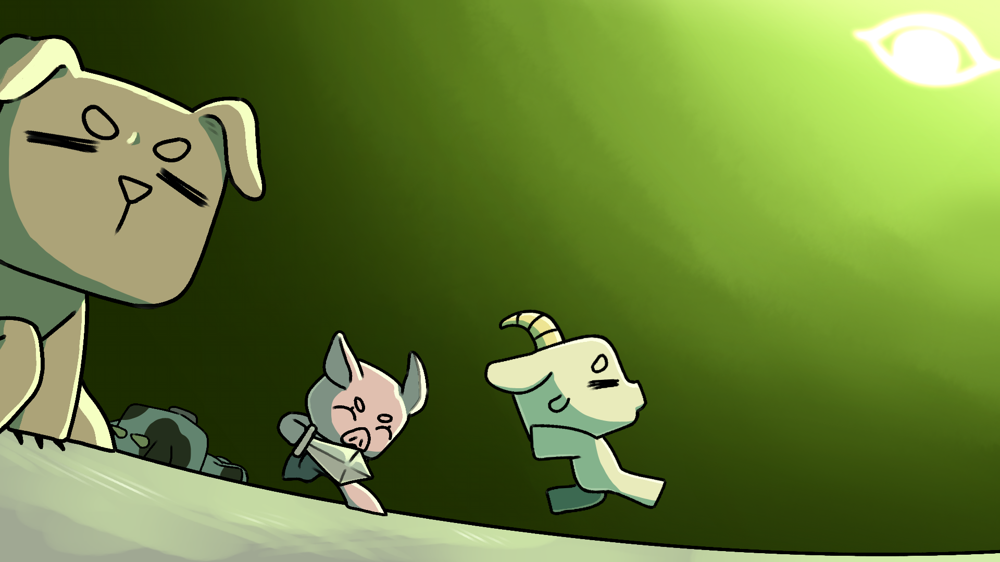

[Project: Helliowin](https://github.com/brid1ed/client)
================== 
***

# ***Bridled 소개***

귀여운 친구들! 귀엽지 않은 전투!

탐욕이 가져온 혼란스러운 세상에는 동물들은 사람들의 목표가 되었어요.
갈 곳 없는 자들도, 빛을 보지 못했던 자들도 자신만의 가치관에 맞는 동물처럼 되고 싶어했죠.
사람들은 생각이 맞는 사람들과 모여들기 시작했고, 하나의 종교로서 자리를 잡았어요.

근데 사람들은 마음에 안드는게 있나봐요. 세계 곳곳에서 다시 싸움의 불씨가 보여요.
그런데 이상하네요? 작은 동물들이 외로운 싸움을 하고 있어요.
우리가 도와줘야 될거 같아요! 우리의 작은 친구 싸움을 멈출 수 있도록 도와주도록 할까요?!

Member
------
>
> * ### ***이정훈***
> > 1. PM, 기획, 개발(클라이언트)
> > 2. 플레이어, 맵 생성, 몬스터 인공지능
> > 3. 선린인터넷고등학교 인공지능 동아리 PARA
> >
>
> * ### ***유한별***
> > 1. 개발(백엔드, 서버 구축)
> > 2. c# 서버 구축, 서버와 클라이언트 통신 구현, 실시간 게임 서버 구현
> > 3. 선린인터넷고등학교 인공지능 동아리 PARA
> >
>
> * ### ***이강민***
> > 1. 개발(클라이언트)
> > 2. 플레이어 UI, 게임 메뉴 구현, 전투 시스템 구축, 스킬 구현
> > 3. 선린인터넷고등학교 게임개발 동아리 C,real
> >
>
> * ### ***차윤슬***
> > 1. 디자인(캐릭터, 배경, 몬스터, 캐릭터 에니메이션, 스킬, UI 등)
> > 2. 캐릭터 디자인
> > 4. 선린인터넷고등학교 게임개발 동아리 C,real
> >
> * ### ***서이준루하***
> > 1. 디자인(맵, 맵 배치 구성, 아이템, UI 등)
> > 2. 맵 디자인, 아이템 디자인
> > 3. 선린인터넷고등학교 게임개발 동아리 C,real
--------------

