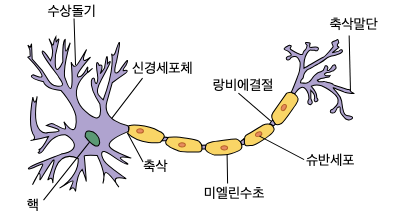
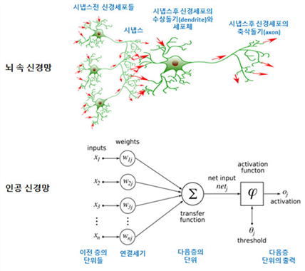
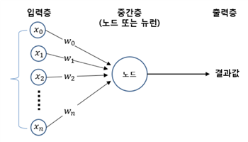
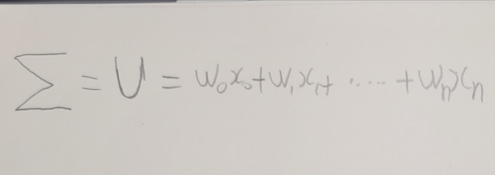
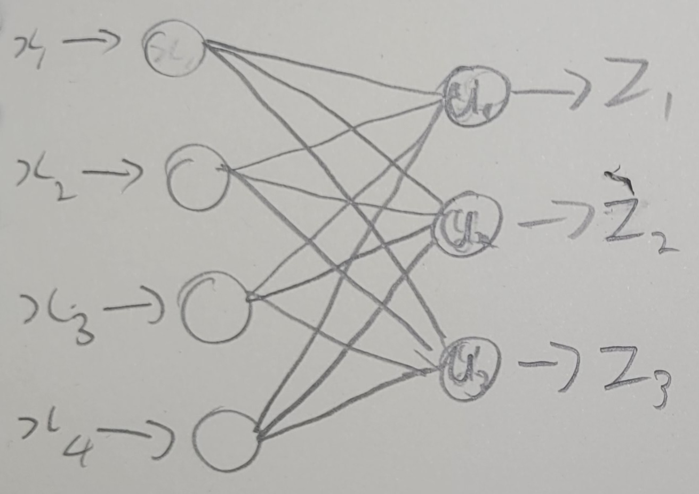

인공신경망이란?
----------

인공신경망(Artificial Neural Network, ANN)은 딥러닝에서 굉장히 중요한 역할을하는 **기본적인 알고리즘**입니다.

ANN은 딥러닝의 기초적인 알고리즘으로써, 인간의 뇌의 프로세스를 모방하여 만들어진 학습 알고리즘입니다.
ANN은 주어진 데이터에서 패턴을 학습하고, 어떠한 값에 대해서 학습된 내용을 바탕으로 예측할 수 있습니다.
현재 ANN은 이미지 인식, 자연어 처리, 음성 인식 등 다양한 곳에서 사용되고 있습니다.

일반적으로 어떠한 형태의 함수(function)이든 근사할 수 있는 
ANN은 일반적으로 어떠한 형태의 function이든 근사할 수 있는 [universal function approximator](https://en.wikipedia.org/wiki/Universal_approximation_theorem)로도 알려져 있다.


# 구조
##  인공신경망에서 뉴런?
### 1. 뉴런
뉴런(Neuron)은 신경계와 신경조직을 이루는 기본 단위(in 생명과학)라고 알려진 신경 세포입니다.
신경계의 모든 작용은 **신경 세포와 세포 간의 상호작용**으로 인해 이루어집니다.

예를 들어봅시둥, 우리 몸의 내부와 외부에 자극을 가하게 되면 일련의 과정을 통해서 뉴런은 자극을 전달하게 됩니다.
최종적으로는 척수와 뇌 등의 중추신경계로 도달하게 되면서 중추신경계에서 처리한 정보를 다시 우리 몸으로 전달해 명령을 수행합니다.

<center>


</center>

뉴런은 수백 개가 연결되어 있고, 신호를 전달하는 과정을 수업이 거치게 됩니다.
이 **뉴런들의 입력, 출력의 신호는 다른 신호입니다.**

<br>
<center>

[](https://lh6.googleusercontent.com/proxy/xvHbW0YBhHjyCwD6QakZvFvidDQ9Ft_ALxwW5F3_isEqQeeqUBSSU8f4IDdtGV3BcLrPZiDr3JNYBhKGCSfD7UzRxO5ZieKBJw)
</center>

수상돌기를 통해서 입력된 자극은 축삭돌기를 통해 다음 뉴런으로 전달됩니다.
이때 시냅스에서 신경전달물질이 배출되어 다음 뉴런의 수상돌기를 통해 입력됩니다.
이렇게 전달된 자극은 자극의 일정 정도 이상ㅇ이 되었을 경우 다음 뉴런으로 전달됩니다.

보통 학습이라고 하는 것은 **뉴런과 뉴런 사이의 연결 강도가 바뀌는 것**입니다.
다르게 말하면, 수상돌기에 입력된 자극(신경전달물질)의 세기가 모두 같게 적용되지 않는다는 것!

**신경망의 뉴런과 뉴런 사이의 연결 강도는 학습을 통해서 변화합니다.**

### 2. 인공 뉴런

바로 위에서 설명한 인간의 뉴런 구조에서 영감을 받아 만들어진 놈이 바로 인공 뉴런입니다.
즉 인간의 뉴런 구조에 착안해 만들어진 것이죠. 이러한 **인공 뉴런도 생물학적 뉴런과 비슷한 구조**로 되어있습니다.

<center>

[](http://matrix.skku.ac.kr/math4ai-intro/W13/PICA535.png)
</center>

인공 뉴런의 구조를 그림으로 나타내면 위와 같은 그림이 나옵니다!

인공신경망에서 **학습으로 각 입력에 따른 연결 강도가 정해지는데** 우리는 그것을 가중치(weight, cost)라고 합니다. 위 그림에서 가중치는 w0, w1, w2,..., wn입니다. x0,...xn은 입력되는 값을 의미하며,
학습을 통해 우리가 구하고자 하는 값이 바로 w0, w1, ...., wn입니다.

[//]: # ()
[//]: # (```math)

[//]: # (\sqrt{3})

[//]: # (```)


<center>


(으아... 내 글씨 넘 안 예쁘네..)
</center>

인공뉴런은 입력 x0, x1, ..., xn에 w0, w1, ..., wn가 각각 곱해지고 더해집니다.
이것을 **선형결합(sigma)**이라고 합니다. 이 값은 특정 함수 f에 의해 계산된 값이 출력되어 다음 뉴런의 입력으로 보내집니다.

<center>

### Z = f(U)
</center>


### 3. 활성화 함수

신경계의 뉴런은 들어오는 **자극이 일정 크기 이상이 되어야 다음 뉴런으로 전달**됩니다.
요것을 모방한 놈이 바로 **활성화 함수(Activation Function)**입니다.

활성화 함수는 **선형 결합한 값을 다음 출력으로 보내야 할지를 결정**해 줍니다.


<center>
Z=f(U)  &nbsp;&nbsp;&nbsp;&nbsp;&nbsp;&nbsp;&nbsp;&nbsp;&nbsp;  if U> threshold 1 else 0
</center>

인간의 뉴런은 **선형결합된 값이 일정 크기를 넘어섰을 때, 다음 출력**으로 보내집니다.
요것을 그대로 정의한 활성화 함수가 Binary Step 활성화 함수입니다.


## 인공신경망의 구조

인공신경망은 입력층(Input Layer), 은닉층(Hidden Layer), 출력층(Output Layer)으로
구성되며 **각 층의 뉴런들을 퍼셉트론(Perceptron)**이라고 부릅니다.
입력층의 뉴런의 수는 입력 변수의 수(입력층에서 바이러스를 사용하면 +1개)이며, 출력층은 분류 문제를 해결할 때 분류의 수와 일치합니다.

### 1. 얕은 신경망(Shallow Neural Network)

입력층과 출력층 사이에 있는 숨겨진 계층을 은닉층(Hidden Layer)이라고 합니다.
(뭔가 이름이 멋지지 않나요..? 나만 그런가)

은닉층은 뉴런(Neuron)과 시냅스(Synapse)로 구성된 인간의 두뇌를 모방한 층(Layer)입니다.
**보통 은닉층의 수가 적거나 없는 신경망을 얕은 신경망(Shallow Neural Network)** 이라고 부릅니다.

<center>


(은닉층 X, 출력층만 갖는 신경망의 모습)
</center>

<br><br>


요놈을 이제 수식으로 표현해 볼겁니다.
수식에서 등장하는 **b는 편향(bias)**를 의미합니다.
<center>


</center>

얕은 신경망은 선형(Linear) 문제를 해결할 때 사용할 수 있겠지만...
비선형 문제를 해결해야 할 경우면 더 깊은 신경망이 필요합니다.<br>
(선형, 비선형에 대해선 다른 포스트에 다루고 있습니다.)

### 2. 여러가지 신경망

이제부터 나오는 신경망은 은닉층이 여러개로 구성된 신경망들이 나옵니다!!

DNN, CNN, RNN 등에 대해서 다뤄보도록 하겠습니다.

다른 포스팅에서 뵈어요!


