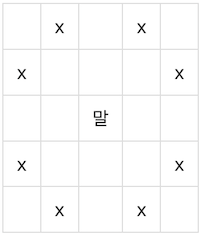

[말이 되고픈 원숭이](https://www.acmicpc.net/problem/1600)

| TimeLimit | MemoryLimit |           Condition            |     TAG     |
|:---------:|:-----------:|:------------------------------:|:-----------:|
|    2s     |    256MB    | (1<= N, M <= 200<br/>0<=K<=30) | BFS(너비우선탐색) |

[//]: # ( |   | X  |    | X |   |)
[//]: # ( |:-:|:--:|:--:|:-:|:-:|)
[//]: # ( | X |    |    |   | X |)
[//]: # ( |   |    | 말  |   |   |)
[//]: # ( | X |    |    |   | X |)
[//]: # ( |   | X  |    | X |   |)
[//]: # ()

> 동물원에서 막 탈출한 원숭이 한 마리가 세상구경을 하고 있다.
> 그 녀석은 말(Horse)이 되기를 간절히 원했다.
> 그래서 그는 말의 움직임을 유심히 살펴보고 그대로 따라 하기로 하였다. 말은 말이다. 말은 격자판에서 체스의 나이트와 같은 이동방식을 가진다. 다음 그림에 말의 이동방법이 나타나있다. x표시한 곳으로 말이 갈 수 있다는 뜻이다. 참고로 말은 장애물을 뛰어넘을 수 있다.
> <center>
>
> 
> </center>
>
> 근데 원숭이는 한 가지 착각하고 있는 것이 있다. 말은 저렇게 움직일 수 있지만 원숭이는 능력이 부족해서 총 K번만 위와 같이 움직일 수 있고, 그 외에는 그냥 인접한 칸으로만 움직일 수 있다. 대각선 방향은 인접한 칸에 포함되지 않는다.
>
> 이제 원숭이는 머나먼 여행길을 떠난다. 격자판의 맨 왼쪽 위에서 시작해서 맨 오른쪽 아래까지 가야한다. 인접한 네 방향으로 한 번 움직이는 것, 말의 움직임으로 한 번 움직이는 것, 모두 한 번의 동작으로 친다. 격자판이 주어졌을 때, 원숭이가 최소한의 동작으로 시작지점에서 도착지점까지 갈 수 있는 방법을 알아내는 프로그램을 작성하시오.

이 문제가 파놓은 함정이 있는데, 여기서 k만큼 먼저 움직이고 동서남북으로 이동하는 것이 아니었다. 그냥 아무때나 해도된다는 것을 알고 문제 풀이를 들어가야한다.
(요건 때문에 좀 힘들었음. 너무 모호했음)

일단 문제는 그걸로 이동하면 되면서, 시간, 메모리 초과가 나지 않도록 적절히 visit처리 해주기만하면 금방 풀 수 있는 문제이다.

내일이 시험인데 백준풀고, 전공 공부하고 있는데 지금 큰일난거 같다.... 흐아 어트카냐

일단 말은 dx, dy와 horsedx, horsedy를 선언하고 이를 토대로 격자판을 탐색하였다.

또한 n=1, m=1일때는 bfs가 시작되지도 않기 때문에 따로 예외처리를 해주었다.

일단 go언어를 공부 중이라(서버 개발 공부중)서 go로 푸는데 큐를 썼는데 바로 import가 안되서 std에 없는 것 같아 직접 구현하여 사용했다.

생각보다 새롭고 재미있는 ps 경험이다. (대회때는 절대 안 쓴다. cpp 사랑해)


Queue 구현
```go
type Pos struct {
	x, y, cost, current_k int
}

type Node struct {
	next *Node
	prev *Node
	item *Pos
}

type Queue struct {
	head, tail *Node
	size       int
}
type IQueue interface {
	Enqueue(*Pos)
	Init()
	Dequeue() *Pos
	Front() *Pos
	Size() int
	Empty() bool
}

func (q *Queue) Enqueue(pos *Pos) {
	var newNode *Node = &Node{next: q.tail, prev: q.tail.prev, item: pos}
	if q.head.next == nil {
		q.tail.prev = newNode
		q.head.next = newNode
		newNode.prev = q.head
	} else {
		q.tail.prev.next = newNode
		q.tail.prev = newNode
	}

	q.size++

}
func (q *Queue) Init() {
	q.head = &Node{next: nil, prev: nil, item: nil}
	q.tail = &Node{next: nil, prev: nil, item: nil}
	q.size = 0
}

func (q *Queue) Dequeue() *Pos {
	if q.head.next == nil {
		return nil
	}

	var remove *Pos = q.head.next.item

	if q.head.next.next == q.tail {
		q.head.next = nil
		q.tail.prev = nil
	} else {
		q.head.next = q.head.next.next
	}
	q.size--
	return remove
}
func (q *Queue) Front() *Pos {
	return q.head.item
}

func (q *Queue) Size() int {
	return q.size
}
func (q *Queue) Empty() bool {
	return q.size == 0
}
```

Enqueue, Dequeue를 구현하고, 안에 들어갈 데이터 pos를 만들어주었다.


<br/>

<br/>
<br/>
<br/>

BFS 구현
```go
for !q.Empty() {
		pos := q.Dequeue()

		if costBoard[pos.y][pos.x][pos.current_k] < pos.cost {
			continue
		}
		costBoard[pos.y][pos.x][pos.current_k] = pos.cost

		if pos.current_k < k {
			for i := 0; i < 8; i++ {
				ny = pos.y + hdy[i]
				nx = pos.x + hdx[i]

				if 0 <= ny && ny < n && 0 <= nx && nx < m && costBoard[ny][nx][pos.current_k+1] > pos.cost+1 {
					q.Enqueue(&Pos{x: nx, y: ny, cost: pos.cost + 1, current_k: pos.current_k + 1})
					costBoard[ny][nx][pos.current_k+1] = pos.cost + 1

				}
			}
		}
		for i := 0; i < 4; i++ {
			ny = pos.y + dy[i]
			nx = pos.x + dx[i]

			if 0 <= ny && ny < n && 0 <= nx && nx < m && costBoard[ny][nx][pos.current_k] > pos.cost+1 {
				q.Enqueue(&Pos{x: nx, y: ny, cost: pos.cost + 1, current_k: pos.current_k})
				costBoard[ny][nx][pos.current_k] = pos.cost + 1
			}
		}
	}
```
솔직히 코드는 너무 직관적으로 쉬워서 금방 읽고 뭔 소린지 이해할 수 있을거라고 생각한다.

기본적인 BFS와 다른점은 바로 costBoard를 3차원으로 선언한 것이데 이것은 k가 자연수일때, 아무때나 말과 같은 점프를 뛸 수 있는데
이를 고려하여, 현재 k가 몇 남아있냐에 따라서 각자 cost를 따로 먹여놓은 것이다.


<details>
<summary> 정답 코드 </summary>

```go
package main

import (
	"bufio"
	"fmt"
	"math"
	"os"
)

type Pos struct {
	x, y, cost, current_k int
}

type Node struct {
	next *Node
	prev *Node
	item *Pos
}

type Queue struct {
	head, tail *Node
	size       int
}
type IQueue interface {
	Enqueue(*Pos)
	Init()
	Dequeue() *Pos
	Front() *Pos
	Size() int
	Empty() bool
}

func (q *Queue) Enqueue(pos *Pos) {
	var newNode *Node = &Node{next: q.tail, prev: q.tail.prev, item: pos}
	if q.head.next == nil {
		q.tail.prev = newNode
		q.head.next = newNode
		newNode.prev = q.head
	} else {
		q.tail.prev.next = newNode
		q.tail.prev = newNode
	}

	q.size++

}
func (q *Queue) Init() {
	q.head = &Node{next: nil, prev: nil, item: nil}
	q.tail = &Node{next: nil, prev: nil, item: nil}
	q.size = 0
}

func (q *Queue) Dequeue() *Pos {
	if q.head.next == nil {
		return nil
	}

	var remove *Pos = q.head.next.item

	if q.head.next.next == q.tail {
		q.head.next = nil
		q.tail.prev = nil
	} else {
		q.head.next = q.head.next.next
	}
	q.size--
	return remove
}
func (q *Queue) Front() *Pos {
	return q.head.item
}

func (q *Queue) Size() int {
	return q.size
}
func (q *Queue) Empty() bool {
	return q.size == 0
}

func main() {
	reader := bufio.NewReader(os.Stdin)
	writer := bufio.NewWriter(os.Stdout)

	defer writer.Flush()

	var q IQueue = new(Queue)
	q.Init()
	hdx, hdy, dx, dy := []int{2, 2, -2, -2, 1, 1, -1, -1}, []int{1, -1, 1, -1, 2, -2, 2, -2}, []int{1, -1, 0, 0}, []int{0, 0, 1, -1}

	var k int
	fmt.Fscanln(reader, &k)
	q.Enqueue(&Pos{x: 0, y: 0, cost: 0, current_k: 0})
	var n, m int
	fmt.Fscanln(reader, &m, &n)

	var board [202][202]int
	var costBoard [202][202][32]int

	var limit int = math.MaxInt

	for i := 0; i < n; i++ {
		for j := 0; j < m; j++ {
			fmt.Fscan(reader, &board[i][j])
			if board[i][j] == 1 {
				for k := 0; k < 31; k++ {
					costBoard[i][j][k] = -1
				}

			} else {
				for k := 0; k < 31; k++ {
					costBoard[i][j][k] = limit
				}

			}
		}
	}

	var ny, nx int
	for !q.Empty() {
		pos := q.Dequeue()

		if costBoard[pos.y][pos.x][pos.current_k] < pos.cost {
			continue
		}
		costBoard[pos.y][pos.x][pos.current_k] = pos.cost

		if pos.current_k < k {
			for i := 0; i < 8; i++ {
				ny = pos.y + hdy[i]
				nx = pos.x + hdx[i]

				if 0 <= ny && ny < n && 0 <= nx && nx < m && costBoard[ny][nx][pos.current_k+1] > pos.cost+1 {
					q.Enqueue(&Pos{x: nx, y: ny, cost: pos.cost + 1, current_k: pos.current_k + 1})
					costBoard[ny][nx][pos.current_k+1] = pos.cost + 1

				}
			}
		}
		for i := 0; i < 4; i++ {
			ny = pos.y + dy[i]
			nx = pos.x + dx[i]

			if 0 <= ny && ny < n && 0 <= nx && nx < m && costBoard[ny][nx][pos.current_k] > pos.cost+1 {
				q.Enqueue(&Pos{x: nx, y: ny, cost: pos.cost + 1, current_k: pos.current_k})
				costBoard[ny][nx][pos.current_k] = pos.cost + 1
			}
		}
	}

	var result int = limit

	for i := 0; i <= k; i++ {

		if costBoard[n-1][m-1][i] != -1 && costBoard[n-1][m-1][i] != limit {
			result = min(result, costBoard[n-1][m-1][i])
		}
	}

	if n == 1 && m == 1 {
		result = 0
	}

	if result == limit {
		fmt.Fprintln(writer, -1)
	} else {
		fmt.Fprintln(writer, result)
	}
}

```
</details>