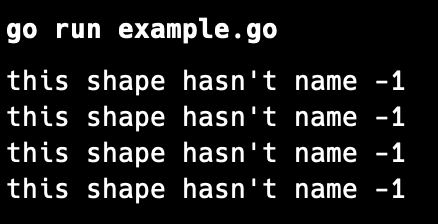
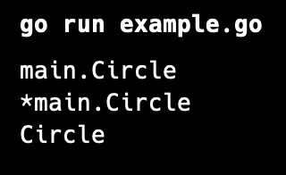

go언어는 공식 문서에서도 "OOP이면서, 아니다" 요런식으로 적혀져 있는데요. 솔직히 말해서 이 "go"라는 친구는 참 뭐라 말하기 어렵네요....

이 친구는 일단 OOP의 4대 특징 

1. 상속
2. 다형성
3. 캡슐화
4. 은닉화

이 네가지를 모두 가지고 있지 않습니다. Go에서는 **Class**와 **상속(inheritance)**를 지원하지 않고 있습니다.
그러나 비슷한 기능을 구현할 수 있는 구조체 합성을 통해서 위의 기능을 구현할 수 있는데요. 오늘은 어떻게 OOP처럼 활용할 수 있을지에 대해서 공부하겠습니다.


먼저 JAVA에서 interface처럼 함수들의 뼈대만 만들어주는 기능을 가지는 "interface"가 Go에도 존재합니다.

<br>

```go
type IShape interface {
    PrintName() string
    GetArea() float64
}
```

override와 OOP를 보여드리기 위해서 Shape를 Base로 하여서 예시를 들어보겠습니다.

Shape의 interface를 선언합니다.

```go

{function_name} {return_data_type}

```
이런 식으로 interface의 함수 프로토타입을 선언할 수 있습니다.


또한 변수를 저장할 컨테이너는 아래와 같이 선언할 수 있는데요?

```go
type Shape struct {
	name string
}
```

struct(구조체)를 통해서 변수를 저정하는 컨테이너를 선언할 수 있습니다.

<br>
<br>

그러면 프로토타입으로 작성됐던 함수를 선언해봅시다.

```go
func (s *Shape) PrintName() string {
	return "this shape hasn't name"
}

func (s *Shape) GetArea() float64 {
	return -1
}
```

**func ({함수 안에서 쓸 변수 이름) *(struct_name)} {func_name} {return_data_type})**

<br>

이렇게 선언이 가능합니다. 그러면 이제 코드로 옮겨서 실행을 시키고 확인해 봅시다.


```go
var shape1 IShape = new(Shape)
var shape2 = new(Shape)
shape3 := new(Shape)
shape4 := Shape{}

fmt.Println(shape1.PrintName(), shape1.GetArea())
fmt.Println(shape2.PrintName(), shape2.GetArea())
fmt.Println(shape3.PrintName(), shape3.GetArea())
fmt.Println(shape4.PrintName(), shape4.GetArea())
```
위와 같이 선언을 할 수 있습니다. shape 모두 다른 객체지만 결과는 똑같이 나오게 됩니다.

<center>


</center>

<br>
---------

<br>

그럼 이제 어떻게 활용을 할 수 있을까요?

먼저 제일 절실하게 기다리셨던 Override를 해봅시다!


```go
type Circle struct {
	Shape
	radius float64
}

func (c *Circle) PrintName() string {
	return "Circle"
}

func (c *Circle) GetArea() float64 {
	return math.Pi * c.radius * c.radius
}
```

위와 같이 새로운 구조체를 선언하고, 제일 처음 줄에 상속받을 구조체를 넣으시면 됩니다.
또한 함수 선언도 똑같이 하시면 된답니다.
함수를 더 추가하고 싶으시다면 interface를 또 다시 추가하셔서 진행하실 수 있습니다.

<br>
<br>

```go
var circle Circle = Circle{}
fmt.Println(reflect.TypeOf(circle))
circle.radius = 10
var a IShape = &circle
fmt.Println(reflect.TypeOf(a))
fmt.Println(a.PrintName())
```

여기서 이렇게 실행을 하게되면, 아래와 같은 결과를 가져옵니다.

<center>


</center>

이 결과를 통해서 오버라이드까지 해보았습니다.

이제 Go에 대해서 조금 더 깊이 들어가보도록 하겠습니다.

다음 포스팅에서 뵈어요!!