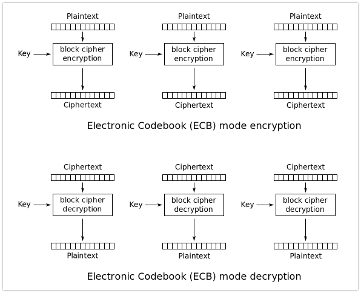

## ECB란?

ECB(Electronic CodeBlock) 모드는 긴 평문을 암호화하는 가장 간단한 방법으로 알려져있다.

다음과 같이 정의된다.
:::note[define]
Cᵢ = E(K, Pᵢ)         i = 1, ..., k
:::

ECB가 메시지의 블록들을 각기 암호화하는 방식은 정말 간단하다.

:::note[]
- 가장 단순한 모드로 블록단위로 순차적으로 암호화 하는 구조이다.
- 한개의 블록만 해독되면 나머지 블록도 해독이 되는 단점이 있다. (Brute-Force Arttack, Dictionary Attack)
- 암호문이 블록의 배수가 되기 때문에 복호화 후 평문을 알기 위해서 Padding을 해야한다.
- error propagation : 각 블록이 독립적으로 동작하므로 한블록에서 에러가 난다고 해도 다른 블록에 영향을 주지 않는다. 해당 블록까지 에러 전파.
:::

-------

## ECB 구조는 사용을 권장하지 않는다!

### ECB는 상당한 취약성을 가지고 있다.
**두 개의 평문 블록이 같다**면 **각 평문과 대응하는 암호문 블록이 동일**하게 됨으로,
공격자는 **어떤 것이 같은 평문인지 쉽게 알아**낼 수 있다.
메시지 구조에 따라 이런 특성은 공격자에게 **꽤 많은 정보를 흘릴 가능성**이 있다.
일반적으로 이런 속성이 ECB를 취약하게 만든다.

:::tip[정리]
ECB는 상당한 취약성을 가지므로 사용하지 말자
:::

 
 

[참고](https://blog.naver.com/sanainfo/221517009223)