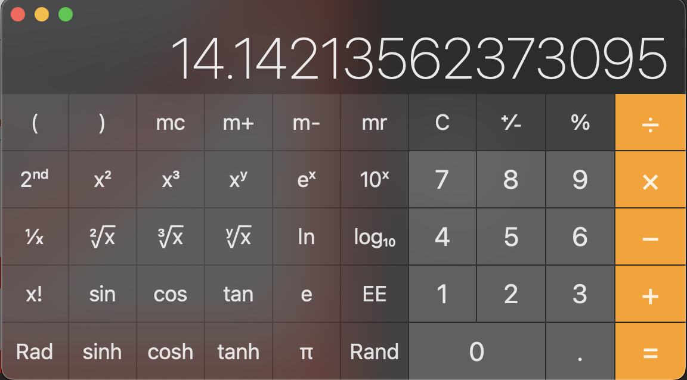
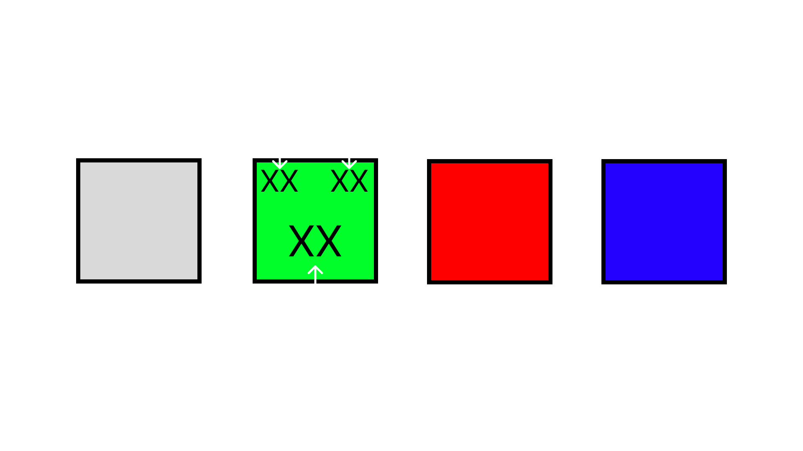
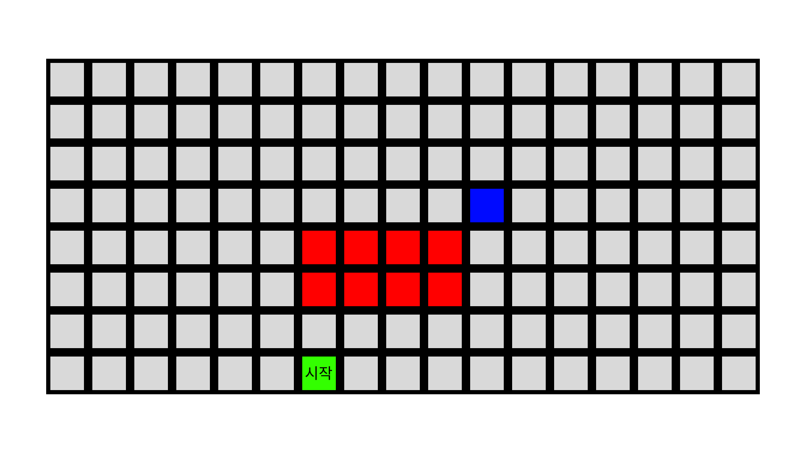
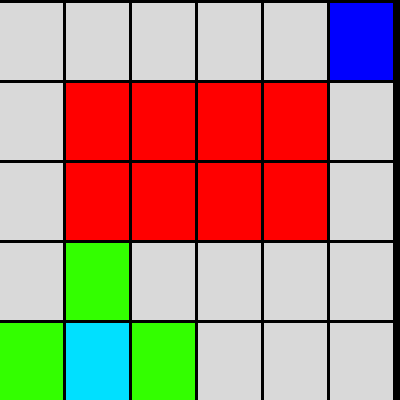
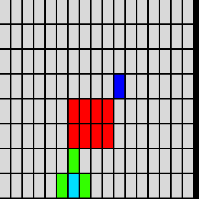

다익스트라 알고리즘보다 더 빠른거... 뭐 더 없을까???
바로 A*(에이스타)라는 알고리즘이 있다. 사실상 길찾기 알고리즘하면 제일 먼저 떠오르는 친구가 아닐까 싶다.
굉장히 유명하면서, 실제로도 많이쓰고 있다. 정말 놀랍게도 Unity 엔진에서 쓰는 NavMesh 또한 A* 기반으로 동작한다. 
오래전에 만들어졌지만 아직까지도 많이 사용되고 있는 알고리즘인 만큼 배워두는 것은 좋을 것이다. 

<br>

:::note[이 포스팅에서는]

이 포스팅에서는 전적으로 A* 자체에 대해서만 자세히 다루고 있습니다.

A*를 설명하기 위한 다른 개념들 Heuristic(휴리스틱), PriorityQueue(우선순위 큐) 등의 설명은 생략하고 있습니다.

다른 개념의 설명은 다른 포스팅에 있습니다. 따로 참고해주세요!

:::

<br>


[//]: # (A*는 일종의 **휴리스틱**을 통해서 탐색 횟수를 획기적으로 줄일 수 있습니다.)

[//]: # ()
[//]: # (:::tip[간단한 휴리스틱 설명!])

[//]: # (알고리즘과는 큰 차이가 존재한다.)

[//]: # (바로 **최적의 해를 보장**하는 알고리즘과 다르게 휴리스틱은 **최적의 해를 보장하진 못하지만 어느정도 도움이 되는 해**를 알 수 있도록 도움을 준다.)


[//]: # (:::)
이제 A* 대해서 알아보도록 하자<br>
먼저 A*의 특징과 더불어 다른 길찾기 알고리즘들과의 차이점을 찾아보자.

<br>

|           |             BFS             |          Dijkstra           |             A*              |
|:---------:|:---------------------------:|:---------------------------:|:---------------------------:|
| 팀섹 그래프 형태 |            가중치 X            |           가중치 그래프           |           가중치 그래프           |
|  기반 알고리즘  |      BruteForce(완전탐색)       |         Greedy(탐욕)          |         Greedy(탐욕)          |
|    특징     | 시작 노드를 기준으로 모든 노드의 최단 경로 탐색 | 시작 노드를 기준으로 모든 노드의 최단 경로 탐색 | 시작 노드에서 목표 노드까지의 최단 경로만을 구함 |

<br>

:::tip[질문]

표를 보니 다익스트라와 A* 비슷하던데?

시작 노드를 기점으로 모든 노드의 최단 경로를 탐색한다면 다익스트라가 A*보다 더 좋은 것 아닌가요?

:::

이러한 질문이 자연스럽게 생길 것이다. 이것은 일단 다익스트라와 A*의 작동 방식을 이해하면 해소가 된다.

먼저 다익스트라는 시작 노드로부터 시작해서 가장 최소 비용으로 도달한 노드에서 또 다시 도달한 노드를 시작 노드로 선정해서 다음 탐색 노드를 큐에 넣는 식으로 작동한다.

그러나 A*는 이러한 방식과는 다른 점이 꽤 많다.
A*는 다음으로 탐색하는 노드를 정하는 방식이 많이 다르다.<br>
다익스트라는 시작 노드로부터 현재 노드까지의 최소 비용이면 그 노드를 선택했다.<br>
그러나 A*는 **시작 노드부터터 현재 노드까지의 비용 g(n)** 과 **현재 노드부터 도착 노드까지의 예상 비용 h(n)**
이 둘을 더한 값 f(n)의 최소값의 노드를 다음 탐색 노드로 설정한다. 


>
> ## f(n) = g(n) + h(n)
>

이러한 f(n)으로 다음 탐색 노드를 설정한다.

h(n)은 에상 비용을 계산한 값인데... 이 예상 값을 구하는 함수를 Heuristic(휴리스틱) 함수라고 한다. 
또한 휴리스틱을 사용하는 대부분의 알고리즘들은 휴리스틱 함수의 설계 방법에 따라서 알고리즘의 성능이 결정된다.
이 말인 즉 A*의 성능 또한 휴리스틱 함수에 따라서 효율이 달라진다는 것이다.

일단 길찾기 알고리즘이기 때문에 보통은 단순히 노드와 노드 사이의 거리(평면 상에서)를 계산하는 함수를 사용한다.<br>
대표적으로 맨해튼 거리, 유클라디안 거리를 사용한다.

:::tip[상식 up]

맨해튼(Manhattan) 거리: 두 점 사이의 수평 및 수직 이동 거리의 합 = **∣p₁−q₁∣+∣p₂−q₂∣+...+|pₙ-qₙ|**

유클라디안(Euclidean) 거리: 두 점 사이의 수평 및 수직 이동 거리의 제곱의 합의 제곱근 = **sqrt((p₁−q₁)² + (p₂−q₂)²+...+(pₙ-qₙ)²)**

해밍(Hamming) 거리: 맞춤법 검사와 같은 알고리즘에 많이 사용<br>
(이 거리는 그냥 상식으로 알아두자)

**!또한 맨해튼 거리는 항상 유클리드 거리보다 크거나 같다.!**
:::

이 포스팅에서는 이상한 무리수를 다루고 싶지 않기때문에 맨해튼을 사용할 것이다.(숫자가 크긴해도 예시를 그렇게 큰 값을 다루지 않을거기 때문)

<br>


예시를 들어보겠다.
<center>


</center>

일단 예시에서 사용될 한 블럭의 한 변은 10이라는 값으로 고정한다.
이때 대각선의 값은 피타고라스의 정리를 이용해 계산해보면 14.1421...

<center>


</center>
이러한 값이 나오는데 예시에서는 소수점을 모두 버림하고 14로 설정하였다.
<center>


</center>
이렇게 4가지의 블럭이 있다.
<center>


</center>
위와 같은 과정을 통해서 목표에 도달하는데.. 이 값들을 보게된다면 뭔가 알 수도 있다.

정말 놀랍게도 g(n)은 다익스트라와 똑같이 작동하는 값이다.
그러니 휴리스틱을 뺀다면? 다익스트라와 똑같은 결과를 뱉어낼 것이다.

그리고 그림을 보면 알겠지만, 다익스트라와 다르게 퍼져나가지 않고 목표와 가까운 노드를 먼저 방문함으로써 쓸데없는 연산을 줄였다.
한번 비교해볼까?

<center>






</center>


이렇듯 다익스트라는 우리가 모든 노드를 탐색하면서(퍼져나가면서) 탐색을하게 된다.

"우리는 저 목표의 최단 경로만 구하고 싶다!" 이러면 바로 A*를 사용하면 된다.
<center>


</center>
이 얼마나 좋냐!


구현
------------------

A* 알고리즘을 이제 구현을 해보자!

먼저 A*에서는 OpenList, ClosedList가 존재한다.

일단 OpenList는 이제 방문할 노드들이 있는 리스티이며,
ClosedList는 이제 더이상 방문을 하지 않을 친구들을 넣는 리스트이다.

### 과정
1. 초기화
   1. 시작 노드 생성
   2. OpenList(현재 우선순위 큐)에 push
2. 탐색
   1. OpenList에서 f(n)이 최소인 노드를 가져옴
   2. 목적지에 도달을 확인함.
3. 갱신
   1. 현재 노드에서 갈 수 있는 노드들의 예상비용을 각각 계산한다.
   2. 계산한 노드의 f(n)이 원래 업데이트 해놓았던 비용보다 적다면 다시 비용 업데이트, OpenList에 노드를 push
3. 목적지에 도달할때까지 무한반복!

이제 구현된 시각화 코드와 시각화된 결과를 봐볼까요?

<center>


</center>
파랑은 지나갈 수 잇는 곳이고, 초록은 탐색한 곳이며, 검은색은 찾은 최적의 경로입니다.

일부로 저렇게 유도되도록 만들긴 했지만, 실제로 A*가 최적의 해를 주는건 아닙니다.
휴리스틱 기반으로 작동하니 당연하겠지만 위의 결과와 비슷하게, 이상하게 돌아가긴해도, 어느정도 괜찮은 값을 반환하긴 했습니다.


다음에는 JPS와 미로 생성 알고리즘에 대해서 다뤄보겠습니다!! 시험들 화이팅하시궁!!
진짜 1일 1포스팅 끊긴거 디게 기분이 나쁘군용...ㅠㅜ

<details>
<summary> 코드들 </summary>

## 다익스트라 알고리즘

```py

win_width, win_height = 400, 400  # 가로 세로 400 400
rows, cols = 8, 17  # 세로 가로 / 행과 열
# 8*2 = 64 개의 grid
win = pygame.display.set_mode((win_width, win_height))  # (width, height)
pygame.display.set_caption("(그리드 & 다익스트라) 알고리즘")
grid_width, grid_height = win_width // cols, win_height // rows
#                         400 // 4,           400 // 4

target_flag = False  # 목표물이 설정되지 않은 상태
WHITE = (255, 255, 255)  # r, g, b


class Box:
    # constructor.. 박스가 박스이기 위한.. 필요한 것들이 뭐가 있나
    # __init__
    # 필요한것
    # x, y 좌표(위치)
    # start, goal, wall인지
    def __init__(self, x, y, block_width, block_height):
        self.x, self.y = x, y
        self.color = (217, 217, 217)

        self.cost = float('inf')

        self.width, self.height = block_width, block_height
        self.start, self.goal, self.wall = False, False, False
        self.path = False
        self.visited = False

    def setcolor(self, color): self.color = color

    def draw(self, mywin):
        # color = (0, 255, 0)
        pos = (self.x, self.y, self.width - 2.5, self.height - 2.5)
        pygame.draw.rect(mywin, self.color, pos)
import heapq
def dij(g, finish_x, finish_y, window):
    result_path = []
    result_cost = float('inf')
    q = [(0, 6, 7, [], g[6][7])]
    dx, dy = [0, 0, -1, 1], [1, -1, 0, 0]
    xlen, ylen = len(g), len(g[0])

    cnt = 0

    while q:
        cost, x, y, path, bx = heapq.heappop(q)
        if bx.wall == True or \
                result_cost <= cost or bx.cost <= cost: continue
        g[x][y].cost = cost
        bx.cost = cost
        if (x, y) == (finish_x, finish_y):
            if result_cost > cost:
                result_cost = cost
                result_path = path
        colored = []
        for i in range(4):
            nx, ny = x + dx[i], y + dy[i]
            if 0 <= nx < xlen and 0 <= ny < ylen:
                heapq.heappush(q, (cost + 1, nx, ny, path + [(x, y)], g[nx][ny]))
                colored.append((g[nx][ny], g[nx][ny].color))

        bx.setcolor((0, 224, 255))
        for b, c in colored:
            if c == (255,0,0): continue
            b.setcolor((51, 255, 0))

        for i in g:
            for j in i:
                j.draw(win)

        for b, c in colored: b.setcolor(c)

        pygame.image.save(window, "./screen_to_blog/blog_"+str(cnt)+".png")
        cnt+=1

        bx.setcolor((21, 106, 0))

        # win.fill(WHITE) #(r,g,b)
        # pygame.display.update(win)
        pygame.display.flip()
        pygame.time.delay(200)
    return result_path if result_cost != float('inf') else None


def solution():
    global target_flag
    # 그래픽 처리는 무조건 refresh 화면을 계속 찍는것
    g = []  # grids
    for i in range(cols):
        temp = []
        for j in range(rows):
            temp.append(Box(i * grid_width, j * grid_height, grid_width, grid_height))  # object 넣기
        g.append(temp)
    start_box = g[0][0]
    start_box.visited = True
    start_box.start = True
    start = False
    q = [start_box]
    target_pos = (0, 0)
    isRun = True
    while isRun:
        # 이벤트.. 이벤트 프로그래밍..  in cs
        for event in pygame.event.get():
            if event.type == pygame.QUIT:
                pygame.quit()
                sys.exit()  # system
            elif event.type == pygame.MOUSEMOTION:
                position = pygame.mouse.get_pos()  # (x, y) 현재 마우스의 위치를 return함 tuple의 형태로
                x, y = position
                x, y = x // grid_width, y // grid_height
                if event.buttons[0]:  # 왼쪾 마우스가 클릭되면
                    print(f"방해물 설정 중 : 좌표 x = {x}, y = {y}")
                    if (x, y) == target_pos or (x, y) == (0, 0): continue
                    g[x][y].setcolor((255, 0, 0))
                    g[x][y].wall = True
                # 1번은 마우스 휠
                elif event.buttons[2] and target_flag == False:  # 오른쪽 마우스 클릭되면
                    print(f"목표물 설정 : 블럭 좌표 x = {x}, y = {y}")
                    g[x][y].setcolor((0, 0, 255))
                    g[x][y].goal = True
                    target_pos = (x, y)
                    target_flag = True
            elif event.type == pygame.KEYDOWN and target_flag == True:  # 키가 눌렸다면 실행
                print('알고리즘 시작')
                start = True
                g[6][7].start = True
                isRun = False
                nf = dij(g, target_pos[0], target_pos[1], win)
                if nf == None: return "경로 없음"
                else:
                    for (x,y) in nf:
                        g[x][y].setcolor((100,100,100))

        for i in g:
            for j in i:
                j.draw(win)

        # win.fill(WHITE) #(r,g,b)
        # pygame.display.update(win)
        pygame.display.flip()
    while True:
        for event in pygame.event.get():
            if event.type == pygame.QUIT:
                pygame.quit()
                sys.exit()  # system
        for i in g:
            for j in i:
                j.draw(win)
    return
```


## A* 알고리즘 코드
```py
class Astar():
    def __init__(self, grid):
        self.grid = grid

    def heuristic_Diagonal_Distance(self, node, goal, D1=1, D2=2 ** 0.5):
        dx = abs(node.position[0] - goal.position[0])
        dy = abs(node.position[1] - goal.position[1])

        return D1 * (dx + dy) + (D2 - 2 * D1) * min(dx, dy)

    def heuristic_Euclidean_Distance(self, current, end):
        return ((current.position[0] - end.position[0]) ** 2)\
                + ((current.position[1] - end.position[1]) ** 2)

    def CalcNode(self, childNode, currentNode, endNode):
        childNode.g = currentNode.g + 1 + childNode.density ** 2
        childNode.h = self.heuristic_Euclidean_Distance(currentNode, endNode)
        childNode.f = childNode.g + childNode.h

    def NodeSet(self, node, g: int, f: int, h: int):
        node.g = g
        node.h = h
        node.f = f

    def getPath(self, node, board: list[list]):
        path = []
        while node.parent != None:
            y, x = node.position
            board[y][x] = node.f
            path.append(node.position)
            node = node.parent
        return path[::-1]

    def AStar(self, board: list[list], start: tuple, end: tuple, delay: int = 0):
        import heapq as hq
        from CompyLib.Algorithms import Node

        startNode = Node(None, start, board[start[0]][start[1]], 0)
        endNode = Node(None, end, board[end[0]][end[1]], 0)

        self.NodeSet(startNode, 0, 0, 0)

        openList: list[Node] = list()
        closedList: list[Node] = list()

        openList.append(startNode)
        dx, dy = [0, 0, -1, 1, -1, -1, 1, 1], [-1, 1, 0, 0, -1, 1, -1, 1]

        Visualization = self.grid != None
        self.CalcNode(startNode, startNode, endNode)
        while openList:
            currentNode: Node = hq.heappop(openList)
            closedList.append(currentNode)
            if Visualization:
                self.grid.changeBox(self.grid.getBoxbyIndex(currentNode.position[0],
                                                            currentNode.position[1]), "GREEN")

            if endNode == currentNode:
                return self.getPath(currentNode, board)

            children: list[Node] = []

            for i in range(8):
                ny = currentNode.position[0] + dy[i]
                nx = currentNode.position[1] + dx[i]

                if 0 > ny or ny >= len(board) or 0 > nx or \
                        nx >= len(board[0]) \
                        or board[ny][nx] == 1:
                    continue
                children.append(Node(None, (ny, nx), board[ny][nx], 0))
            for child in children:
                if child in closedList: continue
                self.CalcNode(child, currentNode, endNode)
                # print(child.f, currentNode.f, currentNode, child)
                # if child.f > currentNode.f: continue or child.g + child.density > currentNode.g + 1: continue  # or
                # child.g + child.density <= currentNode.g + 1:
                flag: bool = False
                for node in openList:
                    if child == node and child.g > node.g:
                        flag = True
                        break
                if flag: continue

                child.parent = currentNode

                hq.heappush(openList, child)
            if Visualization: self.grid.boardUpdate(delay)

        return -1

```


# 격자 생성
```py
class Type:
    def __init__(self, screen: p.Surface = None, row: int = 5, col: int = 5):

        self.Running = True

        # Pygame 객체

        self.screen = screen
        self.row = row
        self.col = col

        if screen == None: self.Running = False

        # 기본 색 설정

        self.RED: tuple = (255, 0, 0)
        self.BLUE: tuple = (0, 0, 255)
        self.GREEN: tuple = (0, 255, 0)
        self.BLACK: tuple = (0, 0, 0)
        self.WHITE: tuple = (255, 255, 255)

        # 색 접근
        self.custom_color: dict = {"RED": self.RED, "BLUE": self.BLUE,
                                   "GREEN": self.GREEN, "BLACK": self.BLACK,
                                   "WHITE": self.WHITE, "ORANGE": (255, 95, 0),
                                   "DARKORANGE": (255, 135, 0), "GOLD": (255, 215, 0),
                                   "YELLOW": (255, 255, 0), "AQUA": (0, 255, 255),
                                   "NAVYBLUE": (0, 0, 95)}
        self.color_idx: list = ["BLUE", "RED", "GREEN", "BLACK", "WHITE", "ORANGE",
                                "DARKORANGE", "GOLD", "YELLOW", "AQUA", "NAVYBLUE"]

    def update(self):
        return

    def changeColor(self, *inp):
        length: int = len(inp[0])

        # print(inp[0])

        inp = inp[0]

        if length < 2 or type(inp[1]) != str:
            return False

        if inp[1] not in self.custom_color.keys():

            if length < 3 or type(inp[2]) != tuple:
                return False

            self.custom_color[inp[1]] = inp[2]

        ret: str

        if type(inp[0]) == int:
            ret = self.color_idx[inp[0]]
            self.color_idx[inp[0]] = inp[1]
        elif type(inp[0]) == str:

            if inp[0] not in self.color_idx:
                return False

            ret = inp[0]
            self.color_idx[self.color_idx.index(inp[0])] = inp[1]
        else:
            return False

        return ret

    def addColor(self, name: str, color: tuple):

        if name == None or name == "":
            return False

        self.custom_color[name] = color
        return True
        
        
class Grid(Type):

    def __init__(self, screen: p.Surface = None,
                 row: int = 5, col: int = 5,
                 space: float = -1.5):

        super().__init__(screen, row, col)

        self.space = space
        self.board: list = list()  # [[0 for i in range(row)] for i in range(col)]

        (sc_width, sc_height) = screen.get_size()

        self.bx_width = sc_width // row
        self.bx_height = sc_height // col

        for i in range(row):
            self.board.append(list())

            for j in range(col):
                self.board[i].append(Box(i * self.bx_width, j * self.bx_height,
                                         self.bx_width + space, self.bx_height + space))  # x, y, width, height, color

    def boardUpdate(self, delay: int):
        self.screen.fill(self.WHITE)

        for i in self.board:
            for j in i:
                j.draw(self.screen, p)
        p.display.flip()

        p.time.delay(delay)

    def Colors(self):
        cnt: int = 0

        for name, rgb in self.custom_color.items():
            cnt += 1
            print(f"{name}의 rgb값은 {rgb}  ", end='')
            if cnt // 3 == 1:
                cnt = 0
                print()

    def changeColor(self, *inp):
        res: str = super().changeColor(inp)
        if not res: return False
        for i in self.board:
            for box in i:
                if box.colorName != res: continue
                box.colorName = inp[1]
                box.color = self.custom_color[inp[1]]
        return True

    def changeBox(self, *inp):
        # x: int, y: int, color=0):
        box: Box

        if len(inp) > 2:
            x, y = inp[0], inp[1]
            box = self.board[y][x]

            if type(inp[2]) == int:
                color: int = inp[2]
            else:
                color: str = inp[2]
        else:
            box = inp[0]

            if type(inp[1]) == int:
                color: int = inp[1]
            else:
                color: str = inp[1]
        # print(inp, box, color)
        if type(color) == int:
            box.colorName = self.color_idx[color]
            box.color = self.custom_color[box.colorName]

        elif type(color) == str:
            box.colorName = color
            box.color = self.custom_color[color]

        else:
            return False
        return True

    def getBoxbyCoordinate(self, x: int, y: int):
        return self.board[x // self.bx_width][y // self.bx_height]

    def getBoxbyIndex(self, x: int, y: int):
        return self.board[y][x]

    def getBox(self, x: int, y: int):
        return self.getBoxbyCoordinate(x, y)

```

</details>