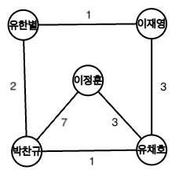

:::note[주의]
이 포스팅은 "큐(Queue), BFS(너비우선탐색), 그래프(Graph theory), 힙(Heap)"에 대한 이해가 필요합니다.
:::


일단 가중치가 없는 그래프에서는 DFS, BFS는 갈 수 있는 노드를 탐색하는 과정을 하는데, 다익스트라 알고리즘은 가장 빨리 도착할 수 있을 때, 얼마나 빠르게? 어떻게(경로)를 알 수 있다.
이것을 네비게이션으로 에를 든다면, 네비게이션은 길을 찾을 때 여러가지 변수를 고려한다. 이동거리, 시간, 경제적 비용, 혼잡도 등이 될 수 있다.
이런 변수들을 고려한 알고리즘이 바로 다익스트라 알고리즘이다. 즉 다시말해서 **Dijkstra 알고리즘은 BFS알고리즘을 확장하여 사용하는 최소비용 경로를 탐색하는 알고리즘이다.**

다익스트라 알고리즘은 특정 노드에서 갈 수 있는 모든 노드들까지의 최단 경로를 구하는 알고리즘이다.
각 노드들은 고유한 비용(cost), 부모(parent)를 가지고 있다.

<center>


<br> 이 그래프를 가지고 설명하도록 하겠다.
</center>

우선 간선(edge) 옆에 써져있는 숫자를 비용이라고 하겠다.

만약 시작 노드를 이정훈이라고 했을때, "이정훈"을 기준으로 박찬규는 최소 비용으로 4만큼 떨어져있다.<br>
만약 시작 노드를 유한별이라고 했을때, "유한별"을 기준으로 박찬규는 최소 비용으로 2만큼 떨어져있다. 

즉 비용 및 부모는 시작 노드에 따라서 결과가 바뀔 수 있다나느 것을 의미한다.

[//]: # (일단 작동방식은 BFS와 비슷하게 큐를 이용해서 작동한다. 그러나 가중치라는 변수가 하나 더 추가되엇을 뿐이고, 업데이트 여부를 변수의 값에 따라서 판단할 뿐이다.)
큐를 이용해 현재 노드에서 갈 수 있는 모든 노드들을 큐에 넣는다. 큐에서 다시 넣었던 노드를 빼내고 현재의 가중치를 저장한다.
만약 다시 같은 노드를 방문한다면 이전에 기록했던 가중치와 비교하여 작다면 갱신하고, 아니면 무시한다.

이때 위의 방법을 쓴다면 노드 수가 굉장히 많은 경우에는 비효율적일 것이다.

계속해서 더 이상 확인이 필요없는 이미 방문한 노드를 방문비교하는데, 노드 수가 많다면 그 비교 횟수가 많아질 것이다.
즉 모든 노드를 돌면서 먼저 가중치 상관없이 노드를 방문하고 다시 비교하고 이동할 때마다 비교를 하기 때문에 효율이 너무 떨어진다.

이런 문제를 해결하기 위해서 우선순위 큐를 사용하여 최적화한다. 이는 힙큐를 통해서 구현할 수 있다.

<center>


</center>

<br>

아래의 표는 행은 순서, 열은 순서대로 Queue의 상태, 현재 Cost의 상태, Parents의 상태를 각각 나타낸다.


오른쪽의 그래프를 Heap 큐를 이용해 다익스트라 알고리즘으로
유한별에서 이정훈을 탐색할 때의 과정이다.

과정에서 중간에 끊기는데 이유는 목표 노드에 도착했기 때문에 다음 노드를 탐색할 필요 없이 코드가 끝난 상황이다.


:::note[정의]

inf = float('inf') # infinity

Cost: 현재 자신의 최소 방문 비용을 저장하고 있는 리스트(또는 배열)
Paraents: 자신을 최소 비용으로 방문한 노드
:::

|   |         Queue(Heap)          |            Cost            |            Parents             |
|:-:|:----------------------------:|:--------------------------:|:------------------------------:|
| 1 |           (0, 유한별)           | [None, inf, inf, inf, inf] | [None, None, None, None, None] |
| 2 |      (1, 이재영), (2, 박찬규)      | [None, inf, inf, inf, inf] | [None, None, None, None, None] |
| 3 |      (2, 박찬규), (4, 유채호)      |  [None, inf, 1, inf, inf]  | [None, None, 유한별, None, None]  |
| 4 | (3, 유채호), (4, 유채호), (9, 이정훈) |   [None, 2, 1, inf, inf]   |  [None, 유한별, 유한별, None, None]  |
| 5 | (4, 유채호), (6, 이정훈), (9, 이정훈) |    [None, 2, 1, inf, 3]    |  [None, 유한별, 유한별, None, 박찬규]   |
| 6 |      (6, 이정훈), (9, 이정훈)      |    [None, 2, 1, inf, 3]    |  [None, 유한별, 유한별, None, 박찬규]   |
| 7 |           (9, 이정훈)           |     [None, 2, 1, 6, 3]     |   [None, 유한별, 유한별, 유채호, 박찬규]   |


그래서 결과는 유한별에서 이정훈으로 갈 때 최소비용은 6, 경로는: 유한별->박찬규->유채호->이정훈이다.


이제 요것을 코드로 다 구현을 해볼것이다.
```py
nodes = ["유한별", "박찬규", "이정훈", "이재영", " 유채호"]<br>
graph = [[(1, 2), (3, 1)], [(2, 7), (4, 1)], [], [(4, 3)], [(2, 3)]]  # node_idx, cost
```
저 그래프를 코드화 시켜보았다.

<br>

이제 로직을 코드로 구현해보자

```py
def solution(start_node, target_node):
    global nodes, graph # 위에서 선언한 nodes와 graph를 가져옴

    inf = float('inf') #inf 무한 선언

    parents = [None, None, None, None, None] # 부모 리스트 선언
    cost = [inf, inf, inf, inf, inf] # 모든 노드들의 시작 노드를 기준으로 최적의 가중치를 저장할 리스트

    q = [(0, start_node)] # 큐 선언 및 초기화
    while q: # 큐가 비어있을 때까지 반복
        current_cost, node = heapq.heappop(q) # 현재 가중치, 현재 노드
        if current_cost > cost[node]: continue # 빙믄힐 노드의 등록된 최소 비용보다 크면 무시
        cost[node] = current_cost
        for idx, cost_ in graph[nodes.index(node)]: #현재 노드에서 갈 수 있는 노드와 그 가중치를 가져옴. (딕셔너리로 작성시 최적화 가능)
            if cost_ + current_cost < cost[idx]: # 현재 가중치와 움직일 노드의 가중치를 더한것이 가는 노드의 가중치보다 작으면 go
                parents[idx] = node # 움직일 노드의 부모를 현재 노드로 업데이트
                cost[idx] = cost_+current_cost
                heapq.heappush(q, (cost_+current_cost, nodes[idx])) # 힙큐 push
        if node == target_node: break # 목표 노드에 도착하면 break

    target = nodes.index(target_node)
    path = target_node+" " # path를 문자열로 이어 붙여 저장
    result_cost = cost[target]
    
    while parents[target]!=None: # 현재 노드의 부모가 None이 아닐때까지
        v = parents[target] != None #현재 노드의 부모가 None이 아닐때까지
        path += v+" " # 문자열 이어 붙이기
        target = nodes.index(v) # 현재 노드로 target을 저장
        
    return f"최적의 경로: {path}, 도착 최소 비용은: {target_node} 입니다."

```

<br><br>

제가 다익스트라를 조금 시각적으로 볼 수 있도록 파이게임을 이용해서 시각화를 하였습니다.


<br>


(0,0)이 시작점입니다.

* 초록색은 움직일 수 있는 땅
* 하늘색은 탐색한 땅
* 빨간색은 갈 수 없는 땅
* 회색은 목표까지의 최적의 경로


(시간도 된다면, A*도 해보겠습니다)
