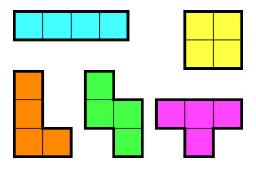

[테트로미노](https://www.acmicpc.net/problem/1955)

| TimeLimit | MemoryLimit |    Condition     |        TAG         |
|:---------:|:-----------:|:----------------:|:------------------:|
|    2s     |    512MB    | (4 ≤ N, M ≤ 500) | Bruteforce(완전 탐색)  |


> 폴리오미노란 크기가 1×1인 정사각형을 여러 개 이어서 붙인 도형이며, 다음과 같은 조건을 만족해야 한다.
> * 정사각형은 서로 겹치면 안 된다.
> * 도형은 모두 연결되어 있어야 한다.
> * 정사각형의 변끼리 연결되어 있어야 한다. 즉, 꼭짓점과 꼭짓점만 맞닿아 있으면 안 된다.
> 
> 정사각형 4개를 이어 붙인 폴리오미노는 테트로미노라고 하며, 다음과 같은 5가지가 있다.
> 
> 
> 아름이는 크기가 N×M인 종이 위에 테트로미노 하나를 놓으려고 한다. 종이는 1×1 크기의 칸으로 나누어져 있으며, 각각의 칸에는 정수가 하나 쓰여 있다.
> 테트로미노 하나를 적절히 놓아서 테트로미노가 놓인 칸에 쓰여 있는 **수들의 합을 최대**로 하는 프로그램을 작성하시오.
> 테트로미노는 반드시 한 정사각형이 정확히 하나의 칸을 포함하도록 놓아야 하며, **회전이나 대칭을 시켜도 된다.**


<br>

내가 한번 틀린 후 정답을 맞히게 되었는데, 내가 걸린 것은 바로 이 "대칭"을 제외하고, 회전만을 신경써서 틀리게되었다.
모두 **회전, 대칭이 모두 가능** 하다는 것을 인지하고, 문제를 접근하자!

<br>

이 문제는 딱히 dp나 다른 방법이 떠오르지 않았다. 문제의 시간 제한도 널널하고 조건 또한 그리 크지않아서
바로 완전 탐색을 돌려 해결하게 되었다.

코드의 설명은 딱히 필요 없을 정도로 굉장히 간단하고, 직관적이라 생략하도록 하겠다.

(현재 나는 go 언어 공부 중에 있어서, go 언어로 ps를 하는 중이다 -> go언어의 이해도를 높이기 위해서)

<br>

먼저 방법만 설명을 하자면,
T, O, L, I, Z 의 대칭, 회전의 모든 모양을 if 처리하여 bruteforce를 돌린 코드이다.
굉장히 간단하고 직관적인다.

<details>
<summary> 정답 코드 </summary>

Go 언어에서 지원하는 기본적인 fmt.Scanf()는 입력을 받는 속도가 느리기 때문에 ps에 활용할때는 시간 초과가 나기 쉽다고 합니다.
그래서 bufio, os에 있는 reader, writer을 선언하고, 입력을 빠르게 받을 수 있도록 Fscan을 통해서 입력을 받았습니다.

다른 블로그를 찾아보니 딱히 reader, writer를 close 해줄 필요는 없는 것 같습니다(in ps)

```go
package main

import (
	"bufio"
	"fmt"
	"os"
)

var board [501][501]int
var n, m int

type pos struct {
	x int
	y int
}

func mymax(a, b int) int {
	if a > b {
		return a
	}
	return b
}

func solution(pos pos, cost int) int {

	if pos.x > m-1 {
		pos.x = 0
		pos.y += 1
		return solution(pos, cost)
	}
	if pos.y >= n {
		return cost
	}

	// L 4가지
	if pos.y < n-2 {
		if pos.x > 0 {
			cost = mymax(cost, board[pos.y][pos.x]+board[pos.y+1][pos.x]+board[pos.y][pos.x-1]+board[pos.y+2][pos.x])
			cost = mymax(cost, board[pos.y][pos.x]+board[pos.y+1][pos.x]+board[pos.y+2][pos.x-1]+board[pos.y+2][pos.x])
		}
		if pos.x < m-1 {
			cost = mymax(cost, board[pos.y][pos.x]+board[pos.y+1][pos.x]+board[pos.y+2][pos.x+1]+board[pos.y+2][pos.x])
			cost = mymax(cost, board[pos.y][pos.x]+board[pos.y+1][pos.x]+board[pos.y][pos.x+1]+board[pos.y+2][pos.x])

		}
	}
	if pos.x > 0 && pos.x < m-1 {
		if pos.y > 0 {
			cost = mymax(cost, board[pos.y][pos.x]+board[pos.y-1][pos.x+1]+board[pos.y][pos.x+1]+board[pos.y][pos.x-1])
			cost = mymax(cost, board[pos.y][pos.x]+board[pos.y-1][pos.x-1]+board[pos.y][pos.x+1]+board[pos.y][pos.x-1])

		}
		if pos.y < n-1 {
			cost = mymax(cost, board[pos.y][pos.x]+board[pos.y+1][pos.x-1]+board[pos.y][pos.x+1]+board[pos.y][pos.x-1])
			cost = mymax(cost, board[pos.y][pos.x]+board[pos.y+1][pos.x+1]+board[pos.y][pos.x+1]+board[pos.y][pos.x-1])

		}
	}

	// I 2가지
	if pos.y > 2 { // 세로
		cost = mymax(cost, board[pos.y-3][pos.x]+board[pos.y-2][pos.x]+board[pos.y-1][pos.x]+board[pos.y][pos.x])
	}
	if pos.x < m-3 {
		cost = mymax(cost, board[pos.y][pos.x]+board[pos.y][pos.x+1]+board[pos.y][pos.x+2]+board[pos.y][pos.x+3])
	}
	// O 1가지
	if pos.x < m-1 && pos.y < n-1 {
		cost = mymax(cost, board[pos.y][pos.x]+board[pos.y+1][pos.x]+board[pos.y][pos.x+1]+board[pos.y+1][pos.x+1])
	}
	// Z 2가지
	if pos.y < n-2 {
		if pos.x < m-1 {
			cost = mymax(cost, board[pos.y][pos.x]+board[pos.y+1][pos.x]+board[pos.y+1][pos.x+1]+board[pos.y+2][pos.x+1])
		}
		if pos.x > 0 {
			cost = mymax(cost, board[pos.y][pos.x]+board[pos.y+1][pos.x]+board[pos.y+1][pos.x-1]+board[pos.y+2][pos.x-1])
		}
	}
	if pos.x < m-2 {
		if pos.y < n-1 {
			cost = mymax(cost, board[pos.y][pos.x]+board[pos.y][pos.x+1]+board[pos.y+1][pos.x+1]+board[pos.y+1][pos.x+2])
		}
		if pos.y > 0 {
			cost = mymax(cost, board[pos.y][pos.x]+board[pos.y][pos.x+1]+board[pos.y-1][pos.x+1]+board[pos.y-1][pos.x+2])
		}

	}
	// T 4가지
	if pos.x > 0 && pos.x < m-1 {
		if pos.y < n-1 {
			// ㅜ
			cost = mymax(cost, board[pos.y][pos.x]+board[pos.y+1][pos.x]+board[pos.y][pos.x+1]+board[pos.y][pos.x-1])
		}
		if pos.y > 0 {
			// ㅗ
			cost = mymax(cost, board[pos.y][pos.x]+board[pos.y][pos.x+1]+board[pos.y][pos.x-1]+board[pos.y-1][pos.x])
		}

	}
	if pos.y < n-2 {
		if pos.x > 0 {
			// ㅓ
			cost = mymax(cost, board[pos.y][pos.x]+board[pos.y+1][pos.x]+board[pos.y+1][pos.x-1]+board[pos.y+2][pos.x])
		}
		if pos.x < m-1 {
			// ㅏ
			cost = mymax(cost, board[pos.y][pos.x]+board[pos.y+1][pos.x]+board[pos.y+1][pos.x+1]+board[pos.y+2][pos.x])

		}
	}

	pos.x += 1
	return solution(pos, cost)

}

func main() {
	// helo
	// fmt.Println("hello")
	var reader *bufio.Reader = bufio.NewReader(os.Stdin)
	var writer *bufio.Writer = bufio.NewWriter(os.Stdout)
	// defer: 이를 호출한 함수의 리턴 직전에 실행한다.
	// Flush: 모든 데이터가 writer에 보내졌음을 의미 (꼭 써줘야한다!)
	defer writer.Flush()

	fmt.Fscanln(reader, &n, &m)

	for i := 0; i < n; i++ {
		for j := 0; j < m; j++ {
			_, err := fmt.Fscan(reader, &board[i][j])
			if err != nil {
				return
			}
		}
	}

	var current pos
	current.y = 0
	current.x = 0
	fmt.Println(solution(current, 0))

}
```
</details>