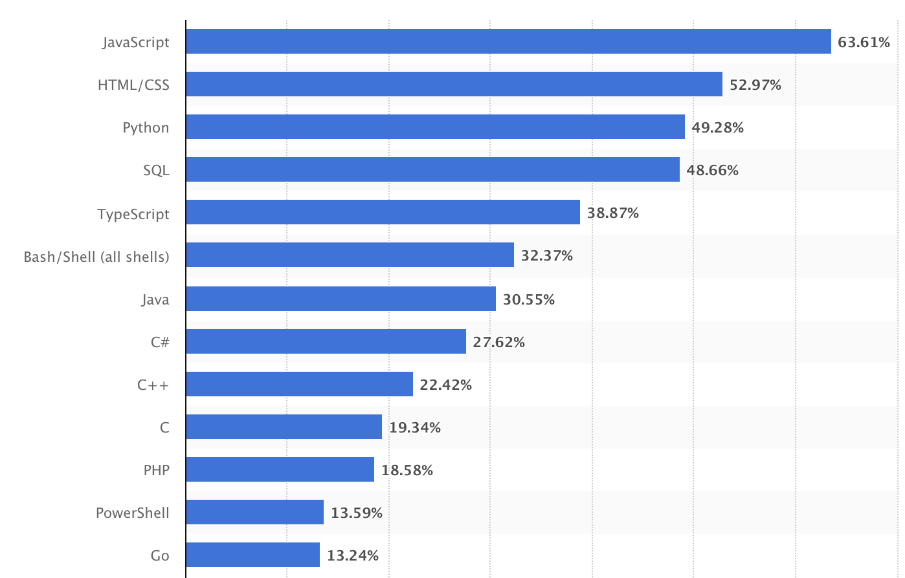

## Go란?

### *빠른 성능, 안정성, 편의성, 쉬운 프로그래밍을 목표로 개발되었으며 범용 프로그래밍 언어입니다.*

현재 많은 대기업에서 사용하고 있으며, "고루틴"이라는 강력한 기능을 가지고 있는 언어입니다.

* 정적 타입, 강 타입
* 컴파일 언어
* 가비지 컬렉션
* 병행성(Concurrency)
* 멀티코어 환경 지원
* 모듈화 및 패키지 시스템
* 빠른 컴파일 속도
* Go 언어의 문법은 C 언어를 기반으로 하고 있으며, C++의 복잡한 문법 대신 간단하고 간결한 문법을 추구하고 있습니다.

2023년 most used language에 올라온 자료

위의 자료처럼 go는 생각보다 많이 사용되고 있습니다.

 

구글이 만든 언어 go.... 꼭 써봐야겠쬬!?! 

이제부터 Go를 공부하며 공부하고, 프로젝트 일지를 작성하도록 하겠습니다.
