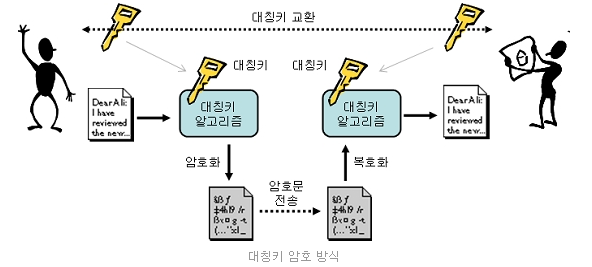
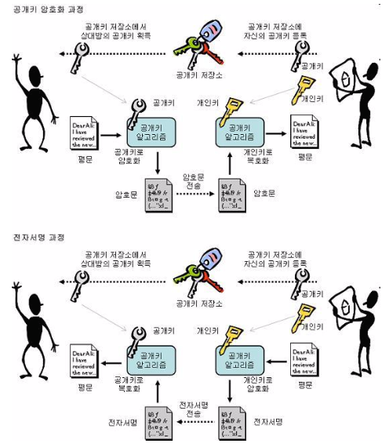

기초 어휘

* 송신자
  * 수신자에게 전달할 내용, 전달 방식 등을 결정하는 주체
* 수신자
  * 송신자가 보낸 메시지의 의미를 해석하고 평가하는 주체
* 공개키(Public key)
  * 사람들에게 공개된 키이며 정보를 암호화 할 수 있다.
* 비밀키(Private key)
  * 사용자만 알고 있는 암호를 풀 수 있는 키

  

# 1. 대칭키
* 암호화, 복호화 할 때 사용하는 **키가 동일**(**1개의 키 사용**)
* 송신자가 A라는 키로 암호화 하였다면, 수신자도 A라는 키를 가지고 있어야 복호화(**같은 키를 이용**)
# 2. 비대칭키
* 암호화 할 때 사용하는 키와 복호화할 때 사용하는 **키가 다른 경우**
* **2개의 키를 사용**하며, 개인키(private key)와 공개키(개인키를 기반으로 생성) 쌍을 이룬 형태

# 3. 사용예

:::tip[각각이 중점을 두는 것은?]
Public Key로 암호화 하면 Data 보안에 중점 
Private Key로 암호화 하면 인증 과정에 중점
:::

## Public Key로 암호화 하는 경우
1. 송신자가  공개키로 data를 암호화 하고 전송 -> 수신자는 자신의 개인키로 data를 복호화 
   * A 키로 암호화 한다면, B키로 복호화가 가능하고, B키로 암호화를 한다면 A키로 복호화가 가능
2. 공개키는 널리 배포될 수 있음 -> 많은 사람들이 한 명의 개인키 소유자에게 data를 보낼 수 있다.

## Private Key로 암호화 하는 경우
1. 개인키의 소유자가 개인키로 data를 암호화하고 공개키와 함께 전달
2. 제공자의 신원을 보장해주기 때문 
   * 암호화된 data가 공개키로 복호화 된다는 것은 공개키와 쌍을 이루는 개인키에 의해서 암호화 되었다는 것을 의미 -> data 제공자의 신원 확인이 보장
3. 이 방법이 공인인증체계의 기본 바탕이 되는 전자 서명

 자세한 내용보기 

# 공개키(public key)와 개인키(private key)

먼저 알아가기 전에 **대칭키**와 **비대칭키(public key)** 에 대해서 알아야합니다.

## 대칭키란?
송신자가 가지고 있는 암호화와 복호화하는 키를 수신자도 똑같이 가지고 있어, 전자문서가 송신자에 의해서 암호화 되어도 
수신자 또한 복호화 할 수 잇는 키를 가지고 있기 때문에 복호화가 가능합니다. 여기서 제 3자가 개입하여 전자문서를 
가져간다고 하더라도 복호화할 수 있는 키를 가지고 있지 않기 때문에 전자문서를 볼 수 없습니다.

**여기서 송신자와 수신자 모두 "똑같은" 키를 가지고 있다는 것(복호화 및 암호화가 단 한개의 키로 이루어짐)이다.**
 

:::note[집중]
대칭키 알고리즘에서는 미리 약속된 대칭키를 사용하지 않을 경우 암호문과 대칭키를 함께 보낼 수 없습니다. 
이 때문에 암호문을 전달하는 경로와 대칭키를 전달하는 경로를 다르게하여 전달해야 안전하게 전달할 수 있습니다.
:::

암호학에서는 **대칭키를 전달하는 것을 "대칭키 교환"** 또는 **"키 교환"** 이라고 하며,
적절한 대칭키 교환 방법이 대칭키 알고리즘을 활용하는데 있어 가장 어려운 문제의 하나입니다.

## 비대칭키란?
사용하는 키와 복호화 할 때 사용하는 키가 다른 경우를 말합니다.
비대칭키는 타인에게 절대 노출되어서는 안되는 비밀키(private key), 비밀키를 토대로 만든 공개키(public key)가 쌍을 이룬 형태입니다.

|            |                                                          대칭키                                                           |                                                                      비대칭키                                                                       |
|:----------:|:----------------------------------------------------------------------------------------------------------------------:|:-----------------------------------------------------------------------------------------------------------------------------------------------:|
|    키 관계    |                                                     암호화 키 == 복호화 키                                                     |                                                                 암호화 키 != 복호화 키                                                                  |
|    암호화키    |                                                          비밀키                                                           |                                                                       공개키                                                                       |
|    복호화키    |                                                          비밀키                                                           |                                                                       개인키                                                                       |
|   비밀키 전송   |                                                           필요                                                           |                                                                       불필요                                                                       |
|    키 길이    |                                                           짧음                                                           |                                                                       길음                                                                        |
|     인증     |                                                           곤란                                                           |                                                                       용이                                                                        |
| 암호, 복호화 속도 |                                                           빠름                                                           |                                                                       느림                                                                        |
|    경제성     |                                                           높다                                                           |                                                                       낮음                                                                        |
|    전자서명    |                                                           복잡                                                           |                                                                       간단                                                                        |
|    주용도     |                                                    고용량 데이터 암호화(기밀성)                                                    |                                                               키 교환 및 분, 인증, 부인방지                                                                |
|     장점     |      * 암호화, 복호화 키 길이가 짧다. * 구현이 용이하, 암호화, 복호화가 빠르다 * 암호 강도 전환이 용이 * 암호 기능 우수 * 각종 암 시스템의 기본으로 활용       | * 사용자가 증가하더라도 관리해야 할 키의 개수가 상대적으로 적다 * key 전달이나 교환에 적합하다 * 인증과 전자서명에 이용 * 대칭키보다 확장성이 좋다 * 여러가지 분야에서 응용이 가능하다 * 키 변화의 빈도가 적다 |
|     단점     | * 키 교환 원리가 명시되지 않음 -> 키 분배가 어렵다 * 관리할 암호화 복호화 키가 많다 N명 -> N(N-1)/2 * 확장성이 낮다 * 전자서명이 불가능 * 부인방지 기능이 없다 |                     * 키 길이가 길다 * 복잡한 수학적 연산을 이용함으로 암호화 복호화 속도가 느리다 * 중간에 인종과정이 없으므로 중간자 공격에 취약하다(전자서명, 인증서 등으로 해결)                      |
|     에시     |                       * [Feistel] : SEED, DES * [SPN] : ARIA, AES, IDEA * 메시지 인증코드(MAC)                        |                                         * Diff-Hellman, RSA, ECC, DAS * [Block chain]  * [TPM]                                          |
 
  

 

:::note[]
### Public Key로 암호화 하면 Data 보안에 중점  
### Private Key로 암호화 하면 인증 과정에 중점  

:::

## Public Key로 암호화 하는 경우
송신자가 상대방의 Public key로 data를 암호화 하고 전송하면, 수신자는 자신의 Private key로 data를 복호화 한다.
A 키로 암호화 한다면, B키로 복호화가 가능하고, B키로 암호화를 한다면 A키로 복호화가 가능한 것이다.
Public Key는 널리 배포될 수 있기 때문에 많은 사람들이 한 명의 Private Key 소유자에게 data를 보낼 수 있다.

## Private Key로 암호화 하는 경우
Private Key의 소유자가 Private Key로 data를 암호화하고 Public Key와 함께 전달한다.
이 과정에서 Public Key와 data를 획득한 사람은 Public key를 이용하여 복호화가 가능하다.

이러한 방법은 data 보호의 목적보다는 public key data 제공자의 신원을 보장해 주어 사용한다.
암호화된 data가 Public Key로 복호화 된다는 것은 Public Key와 쌍을 이루는 Private Key에 의해서 암호화 되었다는 것을 의미한다.
즉 data 제공자의 신원 확인이 보장된다는 것이다.
이 방법이 공인인증체계의 기본 바탕이 되는 전자 서명이라는 것이다.

참고: [Public Key and Private Key](https://blog.naver.com/PostView.naver?blogId=chodahi&logNo=221385524980)

