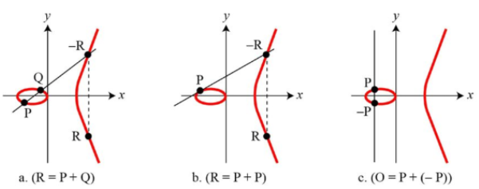

이 포스트를 읽기 전 어휘에 대해서 먼저 알고가자

단어 정리

<!-- summary 아래 한칸 공백 두어야함 -->
* [타원곡선(Elliptic curve)](http://kowon.dongseo.ac.kr/~lbg/web_lecture/it/lec5/lec5.htm)
  * 실수 위에서의 타원곡선은 a와 b가 고정된 실수일 경우에 방정식 y2=x3+ax+b 을 만족하는 (x, y)점들의  집합을 의미
* [디지털 서명](https://ko.wikipedia.org/wiki/디지털서명)
  * 네트워크에서 송신자의 신원을 증명하는 방법
* [암호화](https://ko.wikipedia.org/wiki/암호화)
  * 특별한 지식을 소유한 사람들을 제외하고는 누구든지 읽어볼 수 없도록 알고리즘을 이용하여 정보(평문을 가리킴)를 전달하는 과정
* [암호기술](https://seed.kisa.or.kr/kisa/intro/EgovDefinition.do)
  * 암호기술은 중요한 정보를 읽기 어려운 값으로 변환하여 제 3자가 볼 수 없도록 하는 기술입니다. 암호기술의 안전성은 수학적인 원리에 기반하며, 보안에 있어서 중요한 정보를 직접적으로 보호하는 원천기술
* [암호학에서의 키(KEY)](https://www.cloudflare.com/ko-kr/learning/ssl/what-is-a-cryptographic-key/)
  * 암호 알고리즘과 함께 사용되는 키로 기밀성이 유지되어야 하는 모든 암호키(대칭키, 개인키 등)와 보안매개변수(씨드, 초기값 등)
* [Diffie–Hellman(디피-헬먼)](https://velog.io/@jungbumwoo/%EB%94%94%ED%94%BC-%ED%97%AC%EB%A8%BC-DH-key-Diffie-Hellman-protocol-%EC%9D%B4%EB%9E%80)
  * Diffie-Hellman protocol, DH protocol 은 공개 키를 분배 하는 방안
* [DSA(또는 DSS:Digital Signature Standard)](https://sidneywl2018.tistory.com/52)
  *  미국 정부에의해 공식적으로 승인된 전자서명 기법이다. 가장 대중화 되어있고 이 알고리즘을 Digital Signature Algorithm(DSA) 이라고 부른다.
* [공개키 암호화 알고리즘](https://www.veritas.com/ko/kr/information-center/rsa-encryption)
  * 발신자와 수신자가 서로 다른 키를 사용하여 데이터를 암호화하고 복호화하는 비대칭 알고리즘
*  [RSA 암호화](https://www.veritas.com/ko/kr/information-center/rsa-encryption)
   * RSA는 가장 대표적으로 사용되는 공개 키 알고리즘

 

# 소개

타원곡선 암호기술(Elliptic-curve cryptography, ECC)은 [타원곡선 이론](https://ko.wikipedia.org/wiki/타원곡선)에 기반한 암호 방식이다.

수학에서 타원곡선(Elliptic curve)은 **y2 = x3 + ax + b** 라는 방정식으로 정의되는 곡선을 말한다.
a와 b 값에 따라 다른 곡선 형태와 크기를 갖게 된다.    

타원곡선을 사용하는 암호화 기술인 **ECC**는 [유한체(Finite Field)](https://en.wikipedia.org/wiki/Finite_field) 상의 타원곡선이 갖는 대수적 구조에 기반해 공개키 암호 시스템을 구축한 것이다.

 

<!-- </img>-->

타원곡선(Elliptic curve)에 기반한 ECC를 사용하는 암호화 기술로는, 
타원곡선을 사용하여 Diffie–Hellman 키 교환을 구현한 Elliptic Curve Diffie–Hellman (ECDH),  
DSA를 타원곡선을 사용하여 구현한 Elliptic Curve Digital Signature Algorithm (ECDSA),  
Schnorr 서명 방식에 기반한 Edwards-curve Digital Signature Algorithm (EdDSA),  
타원곡선을 사용한 암호화 방식인 Elliptic Curve Integrated Encryption Scheme (ECIES) 등이 있다.  
즉, 타원곡선 암호기술은 키 교환, 암호화, 디지탈 서명 등에서 두루 사용될 수 있다.

# ECC는 왜 사용할까? 

## **메모리 효율**
  * 아래 표는 대칭 암호에 상응하는 보안 레벨을 갖기 위해서 현재도 많이 사용되고 있는 RSA 알고리즘과 비교한 표이다(키 사이즈(메모리 용량)).  -> 일반적으로 ECC 2배에 해당하는 크기를 RSA가 가진다.

| 대칭키(Symmetric) 암호 | 	RSA  | 	ECC |
|:-----------------:|:-----:|:----:|
|        56         | 	512  | 	112 |
|        80         | 	1024 | 	160 |
|        112        | 2048  | 224  |
|        128        | 3072  | 256  |
|        192        | 7680  | 384  |
|        256        | 15360 | 512  |

## **빠른 성능**
  * 적은 메모리를 사용하면서, 연산에서의 성능(속도) 차이가 발생한다.

# 타원곡선(Elliptic Curve)
y²=x³+ax+³+b라는 [The Weierstrass Form](https://crypto.stanford.edu/pbc/notes/elliptic/weier.html) 이 방정식으로 정의되는 곡선을 말한다.
이는 a, b값에 따라서 여러가지 모양의 곡선을 갖게된다.

기존에 우리가 알던 타원(ellipse)는 2차 방정식을 기반으로 한다. 그러나 타원곡선은 3차 방정식을 사용한다.

## 유한체 상에서의 타원곡선
[타원곡선 암호기술(ECC)](#소개)에서는 실수가 아닌 [유한체(finite field)](#유한체) 상의 타원곡선을 사용한다.
다시말해, ECC는 타원곡선의 (x, y)를 유한체 상의 요소들로 제한하는 것이다.
타원곡선 암호에서는 특히 유한체 중 [소수체(prime field)](https://velog.io/@wansook0316/Finite-Field)와 [이진 확장체(binary extension field)]()를 사용하고 있다.
유한체의 한 종류인 소수체는 정수를 소수 p로 나눈 나머지 집합으로 흔히 GF(p) 혹은 Fp로 표기한다.

:::note[확인해봐요!]
Fp는 {0, 1, 2, ..., p-1} 과 같은 집합을 갖는다.
:::

소수체 상의 타원곡선은 아래 식과 같이 각 점의 요소가 소수 유한체의 요소이며,
타원곡선의 식에 모듈러 연산 (mod p)를 적용한 것이다.

----------------
<!--
ECC는 크게 Prime Curve 혹은 Binary Curve 상에서 정의될 수 있는데, 위에서 설명한 소수체 상에서 정의되는 것을 Prime Curve라 하고, GF(2m) 으로 표현되는 이진 확장 유한체 상에서 정의되는 것을 Binary Curve라 한다.

실수의 타원곡선이 연속적이고 무한한 범위를 갖는 반면, ECC에서 사용하는 타원곡선은 소수체(GF(p)) 혹은 이진 확장 유한체(GF(2m))를 사용하여 점들이 유한하면서 불연속적인 정수값을 갖게 된다. Prime Curve를 사용하는 ECC에서 타원곡선은 E: y2 = x3 + ax + b (mod p) 와 같이 정의된다. 예를 들어, p = 71 인 유한체(F71) 상에서 타원곡선 E: y2 = x3 + 7을 사용한다면, x = 11 일 때, y2 = 113 + 7 (mod 71) = 1338 mod 71 = 60 이 된다. 이때, y2 = 60 (mod 71)을 구하기 위해, 1부터 70까지 순차적으로 y에 대입(전수조사)해 보면, y가 29와 42일 때 60이 나오는 것을 알 수 있다. 아래 그림은 타원곡선 y2 = x3 + 7을 사용할 때, 소수 p가 71인 유한체에서 사용되는 전체 포인트들을 표시한 것이다. 여기서 Fp 상의 타원곡선은 실수에서와 마찬가지로 아벨군의 조건들을 만족한다.

유한체 상의 타원곡선은 연산에서 항상 모듈러 연산(mod p)을 적용하기 때문에, x, y 값이 p-1 보다 크면 모듈러 연산을 통해 나머지 값을 구하게 된다. 또한, 연산에서 음수값이 나오면, 이는 다시 해당 음수값에 상응하는 양수값으로 변환하여 사용한다. 이러한 모듈러 연산으로 인해, 유한체 상의 타원곡선은 x축에 대칭인 -y 값을 갖지 않고, 양수로 변환된 값을 갖는다. 즉, 그래프 상에서 y는 모두 양수이고 중간 지점의 y값을 기준으로 대칭인 모양을 갖는다

## 타원곡선 이산 로그 문제
이산 로그 문제(DLP)는 이산 거듭 제곱의 역으로, ga (mod p) ≡ b 에서 g와 b가 주어졌을 때 a를 구하는 문제이다. ga (mod p)를 계산하는 이산 거듭 제곱은 쉽지만, g와 b만 주어졌을 때 a를 구하기는 매우 어렵다는 점에서 이산 로그 문제는 일방향 함수로 사용된다.

타원곡선 이산 로그 문제(Elliptic Curve Discrete Logarithm Problem, ECDLP)는 타원곡선에서의 이산 로그 문제를 일컫는 것으로, nP = X에서 P와 X를 알고 있을 때 n을 구하는 문제이다. 타원곡선의 스칼라 곱셈에 의해 nP를 빠르게 계산할 수 있지만, 반대로 n을 찾아내는 것은 매우 어렵다는 점에서 ECDLP는 DLP와 같이 일방향 함수로 사용된다. ECDLP는 이산 로그 문제를 타원곡선에 적용한 것으로 통상적으로 포인트 나눗셈 문제라고 부르지 않고 기존 암호시스템의 관습에 따라 타원곡선 이산 로그 문제라고 부른다.

타원곡선에서 스칼라 곱셈은 Double-and-Add 방법과 같은 알고리즘을 사용하여 빠르게 계산될 수 있다. Double-and-Add 방법은 nP에서 n을 이진수로 변환하고, 각 비트를 체크하면서 포인트 더블링과 포인트 덧셈을 하면서 nP 값을 빠르게 계산하는 방법이다.
-->
참고: [Elliptic curve cryptography 개요](http://cryptostudy.xyz/crypto/article/3-ECC-%ED%83%80%EC%9B%90%EA%B3%A1%EC%84%A0%EC%95%94%ED%98%B8)
