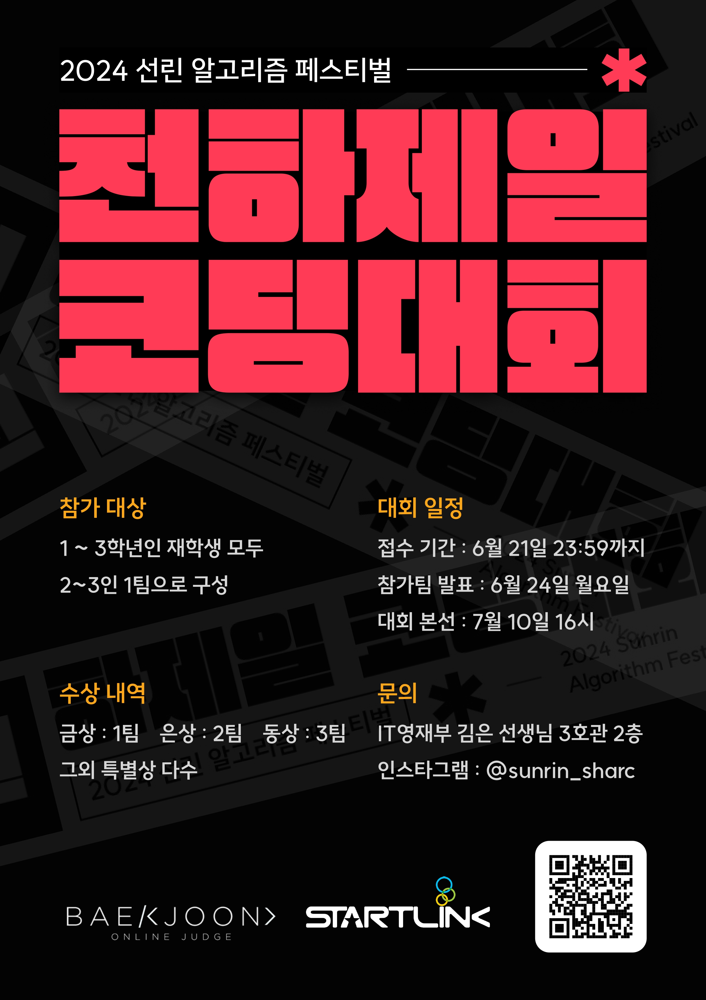
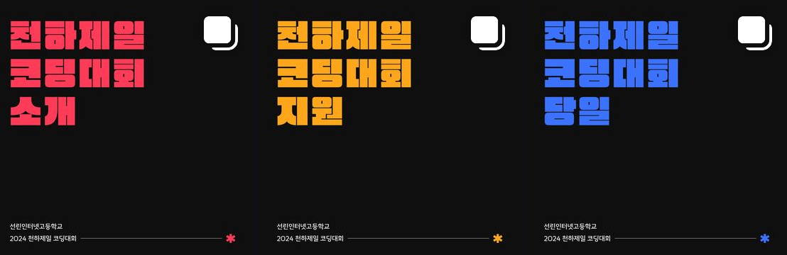
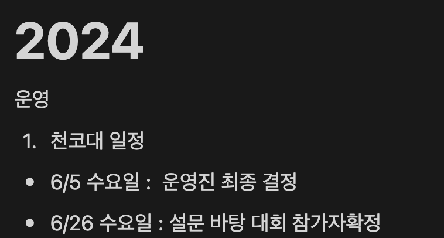

나는 2024년 천코대 2학년 총괄 운영진을 맡게 되었다.

대회가 시작되기 2달 전부터 이미 어느정도 마음의 준비와 계획을 세워 놓았고, 이를 통해서 일정이 잡히자마자 바로 일을 시작했다.

이번 천코대는 SHARC(선린인터넷고등학교 알고리즘 연구부)에서 주관하게 되었다.

천코대의 디자인은 선린 "이주영"이라는 디자이너 친구가 모두 해주었다. 
엄청 부탁해서 운영진으로 오게된 친구이다. 진짜 고급인력!

 
 

천하제일 코딩대회의 인스타 디자인도 킹갓 "이주영"이 모두 해주었다. 그는 신이야

 

일정에 맞춰서 특별상, 운영에 관한 일정, 각자 역할, 예산 사용 등등을 모두 논의하고
대회 들어가기로 하였다. 이제부터가 시작이다.

------------

대회 당일
------------

