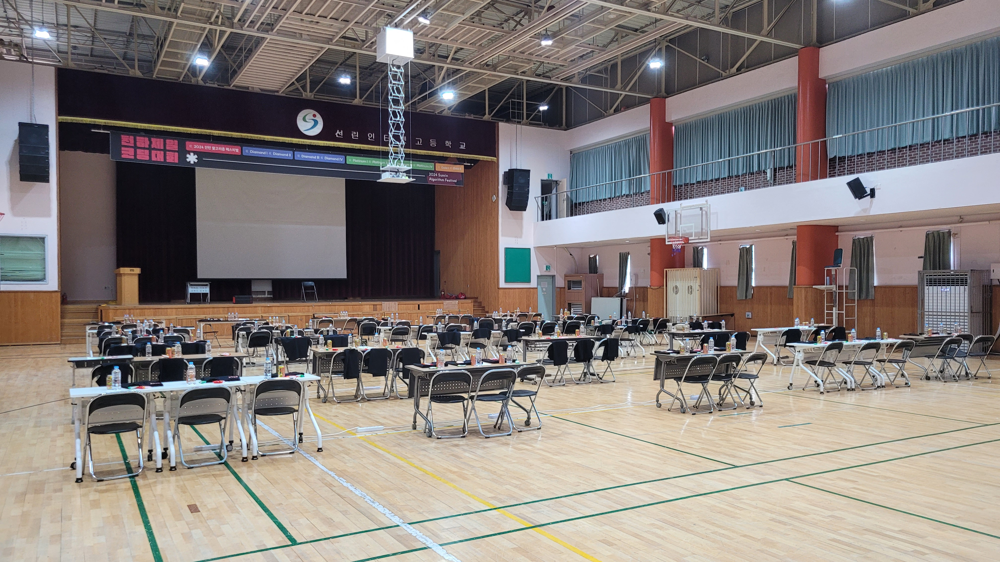
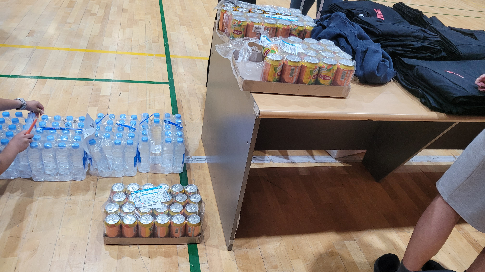
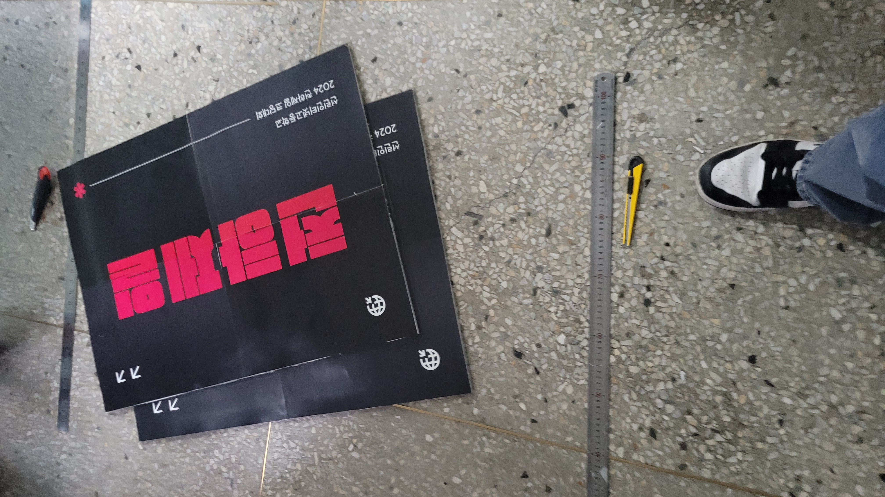

2024 천코대는 정말 많은 사람들의 노력으로 만들어진 대회였습니다.

디자인, 티셔츠, 간식, 장소, 사이트, 문제 등등 아주 많은 것들이 필요했으며 학생들이 재미있게 문제를 풀 수 있는 
환경을 만드는데 운영진 모두가 열심히 노력했습니다. 

일단 올해 천코대는 백준(BOJ)에서 진행될 예정이였으나, 내부 사정을 인해서 자체 제작 사이트에서 대회를 진행하게 되었습니다. 
정말 다행히도 출제진분들께서 채점 사이트를 제작하시고, 대회를 진행할 수 있게 되었습니다. 
출제진분들께서 대회 당일날 오셔서 직접 대회를 같이 즐기셨답니다 ^^

음식을 준비하고, 대회를 준비하고.... 정말 많은 일들이 있었다.

천코대는 문제를 풀면 문제 색에 맞춰서 풍선을 나눠주는데.. 작년 천코대는 3분에 2문제 이상이 풀리면서 풍선을
디게 많이 가져갔었는데.. 이번에는 빠른 솔버가 나오지 않아서 약간 당황했었다. 

그리고... 진짜 큰일날 뻔한 일을 하나 소개해 보겠다.

사실 수상 panel의 디자인만 완성되어 있었는데... 콘텐츠 디자인과에 협조를 요청해서 허락을 받았다. (또 이주영이야.. 그는 신이야!!)

a1 용지를 뽑는 기계가 갑자기.. 오류가 떠버려서 그 기계 앞에서 기도를 하며 펌웨어 업데이트, 재시동, 드라이브 등등 고쳐보려고 시도했지만 실패로 돌아갔다.
그래서 굉장히 급해진 나와 운영진 2명은 다시 콘텐츠 디자인과로 향했고, 콘디과 선생님께서는 퇴근도 하지 않으시고 우리를 도와주셨다.

a3를 4개 뽑아서 여러개 붙이는 식으로 진행을 하였다.
 
와... 너무 힘들었다. 진짜 도와주신 콘디과 선생님 정말 감사합니다.... ㅜㅠㅜㅜㅠ 또 주영아 고마워!!

또 알고보니까 주최가 알연부, 주관이 IT 영재부였단걸 당일날 알게되었다...
내년은 참가자로서 대회에 임할 수 있기를 빈다.. 

## 모두 수고하셨습니다. 좋은 대회를 만들 수 있도록 도움주신 많은 운영진, 선생님들 감사합니다.  또 즐겨주신 참가자분들도 너무 감사해요!! 수고하셨습니다.

