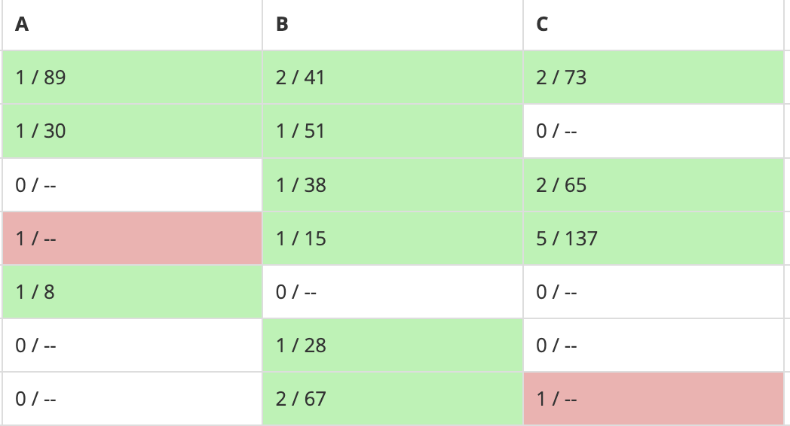

24년 6월 10일에 진행된 정수론 수업을 얘기해볼까 한다.

사실 아직 배운게 많지 않고 1학년을 상대로하는 수업이기 때문에 급발진도 못해서, 한 수업에 많은걸 담지는 못하지만 그래도 꽤 많은 내용을 다뤘다.

1. 에라토스테네스의 체
2. 모듈러 연산
3. 중국인의 나머지 정리
4. 유클리드 호제법

이렇게 4가지를 개념적으로 알려주고, 활용 방법을 설명한다.
그리고 이를 "백준"에서 문제를 풀어보면서 응용 능력을 키웠다.

 
 
 

수업이 끝나고 문제푸는 시간에서 많은 친구들이 시도하고, 생각하면서 실력을 많이 올렸다.

4월달에 첫 수업을 했을때는 구현, 문제 이해, 솔루션의 탐색이 아직 멀었구나... 라고 생각했던게 고작 몇 달전이라는게
너무나 놀라웠다.

백준은 건강에 좋다, 백준해라, ps 꼭 해라 매일매일 풀어봐라 라고 
말했던 것을 직접 실천해준 1학년들이 너무나 대견했다.
무려 4달만에 실, 골, 플 정도 심지어 지금 3달째 되는 
달에는 다이아5를 풀 수 있을 정도로 성장하였다.

나도 알고리즘을 진짜 잘하고, 가르칠 정도는 아니지만 소개하고 방법에 대해서 공유하는 것을 좋아하여 나눴던 것인데
이런 나의 말을 잘 듣고 성장하는 1학년들이 너무나 고맙고 대단하게 느껴졌다.

알연부의 수업은 1, 2학년 모두 얻어가는 것이 있고, 배운다는 것이 누군가 나를 가르쳐서 얻는 것도 있지만 내가 가르치며 아니면 경험을 하면서 얻는 배움도 있다는 깨달음도 주었다.

정말 뜬금없이 일기 비스무리한 것을 쓰고 있는데, 내가 느낀 것을 다른 이에게 공유하는 것도 좋을것 같아 포스팅을 시작하게 되었다.
(사실 이런 이유도 있지만, 1일 1포스팅을 목표로 하고 있어서 쓸거 고민하느라 이런거 씁니다.)
